# AWS Architecture

## High-Level Overview

```mermaid
graph TB
    A[React Native App] --> B[DataStore]
    B --> C[Local SQLite]
    B --> D[AWS AppSync]
    D --> E[DynamoDB]
    B --> F[Sync Engine]
    F --> D

    style A fill:#61DAFB
    style B fill:#FF9900
    style D fill:#232F3E
    style E fill:#4053D6
```



## Key AWS Services

| Service           | Purpose         | Usage in App                                |
| ----------------- | --------------- | ------------------------------------------- |
| **AWS Amplify**   | Framework & CLI | Backend configuration and client libraries  |
| **AWS AppSync**   | GraphQL API     | Managed GraphQL service for data operations |
| **AWS DataStore** | Offline Sync    | Offline-first data synchronization          |
| **DynamoDB**      | Database        | Cloud storage for all data                  |

## Conflict Resolution

The app implements custom conflict resolution in `src/services/ConflictResolution.ts`:

- ✅ **Task Updates**: Prefers local status changes, remote timing updates
- ✅ **Deletions**: Accepts local deletions
- ✅ **Smart Merging**: Preserves user work while accepting server updates

## Data Flow

1. **Local Operations**: All data operations happen against local SQLite database first
2. **Immediate Sync**: DataStore automatically syncs mutations (save/delete) to AppSync immediately when online
3. **Real-time Updates**: Real-time subscriptions via AppSync provide immediate updates across all devices when data changes
4. **Periodic Full Sync**: Full sync runs every 10 seconds as a safety net to catch any missed real-time updates
5. **Conflict Handling**: Custom conflict resolution logic ensures data consistency
6. **Offline Support**: App works completely offline, syncing when connection is restored

## Sync Configuration

The app is configured with:

- **Real-time Subscriptions**: Enabled for immediate cross-device updates via AppSync GraphQL subscriptions
- **Periodic Full Sync**: Every 10 seconds (`fullSyncInterval: 10000`) as a safety net for missed updates
- **No Sync Filters**: All data syncs to all devices (`syncExpressions: []`)
- **Automatic Mutation Sync**: All `DataStore.save()` and `DataStore.delete()` operations automatically sync immediately when online

This ensures iOS, Android, and web all show the same data. If you notice sync issues:

1. Wait up to 5 minutes for the next periodic sync
2. Restart the app to trigger an immediate full sync
3. Check network connectivity - sync requires online status

## Configuration

The app uses AWS Amplify configuration stored in `aws-exports.js` (generated file, not committed to repo).

To pull the latest backend configuration:

```bash
amplify pull --appId d2vty117li92m8 --envName dev
```

## Troubleshooting "Unauthorized" Errors

If you see "Unauthorized" errors when DataStore tries to sync, the API key has likely expired (API keys expire after 7 days by default).

**To fix:**

### Option 1: Pull Latest Configuration (Recommended)

```bash
amplify pull --appId d2vty117li92m8 --envName dev
```

This will update `aws-exports.js` with a new API key if one was regenerated.

### Option 2: Check API Key Status in AWS Console

1. Go to [AWS AppSync Console](https://console.aws.amazon.com/appsync/home?region=us-east-1)
2. Select your API: `lxtodoapp`
3. Go to **Settings** → **API Keys**
4. Check the expiration date of your current API key
5. If expired or about to expire, create a new API key
6. Update `aws-exports.js` with the new key, OR run `amplify pull` again

### Option 3: Regenerate API Key via AWS CLI

```bash
# List current API keys
aws appsync list-api-keys --api-id ocvrkns3mjerdbbt5gpzbukbdq --region us-east-1

# Create a new API key (if needed)
aws appsync create-api-key --api-id ocvrkns3mjerdbbt5gpzbukbdq --region us-east-1 --description "New key for DataStore sync" --expires $(date -u -v+30d +%s) 2>/dev/null || aws appsync create-api-key --api-id ocvrkns3mjerdbbt5gpzbukbdq --region us-east-1 --description "New key for DataStore sync"

# Then run amplify pull to update aws-exports.js
amplify pull --appId d2vty117li92m8 --envName dev
```

**After updating the API key:**

1. Restart your app completely (close and reopen)
2. Check console logs for `[Amplify] ✅ Configured with API_KEY authentication`
3. Verify sync works by checking if data appears across devices

**Note:** The app will now log detailed error messages when sync fails, including specific guidance for "Unauthorized" errors.
