# Project Structure

**Last Updated:** 2025-01-04

## Overview

The Orion Task System is organized as a monorepo with a reusable package (`packages/task-system/`) and a harness application (root `src/`). This structure enables the task system to be consumed by LX teams while maintaining a test environment.

For detailed information on when to add code to each location, see [Root vs Package Boundaries](./root-vs-package-boundaries.md).

## Top-Level Structure

```mermaid
graph TD
    Root["orion-task-system/"]

    Root --> Packages["📦 packages/"]
    Root --> App["📱 app/"]
    Root --> Src["🎨 src/"]
    Root --> Scripts["🌱 scripts/"]
    Root --> Docs["📚 DOCS/"]
    Root --> Models["📦 models/"]
    Root --> Amplify["⚙️ amplify/"]
    Root --> AwsExports["☁️ aws-exports.js"]

    Packages --> TaskSystem["task-system/<br/>Reusable task system package"]
    TaskSystem --> TSrc["src/<br/>Package source code"]
    TaskSystem --> TDocs["docs/<br/>Package documentation (MDX)"]
    TaskSystem --> TConfig["config/<br/>Package configuration"]
    TaskSystem --> TPackage["package.json<br/>Package metadata"]

    App --> Tabs["(tabs)/<br/>Tab-based navigation"]
    App --> Layout["_layout.tsx<br/>App layout configuration"]
    Tabs --> Index["index.tsx<br/>🏠 Dashboard"]
    Tabs --> Questions["questions.tsx<br/>❓ Questions screen"]
    Tabs --> SeedScreen["seed-screen.tsx<br/>🌱 Data seeding"]
    Tabs --> Other1["...<br/>Other tab screens"]

    Src --> AmplifyConfig["amplify-config.ts<br/>Amplify configuration"]
    Src --> AmplifyInit["amplify-init.ts<br/>Amplify initialization"]
    Src --> Bootstrap["bootstrap/<br/>Bootstrap logic"]
    Src --> Components["components/<br/>Harness components"]
    Src --> Screens["screens/<br/>Harness screens"]
    Src --> Contexts["contexts/<br/>Harness contexts"]

    Scripts --> SeedCoord["seed-coordinated-data.ts"]
    Scripts --> SeedAppt["seed-appointment-data.ts"]
    Scripts --> SeedQuest["seed-question-data.ts"]
    Scripts --> Other2["...<br/>Other scripts"]

    Docs --> Architecture["architecture/"]
    Docs --> Development["development/"]
    Docs --> Features["features/"]
    Docs --> Testing["testing/"]
    Docs --> Other3["...<br/>Other docs"]

    Amplify --> Backend["backend/api/lxtodoapp/"]
    Backend --> Schema["schema.graphql<br/>GraphQL schema"]
```



## Package Structure: `packages/task-system/`

The task system package is the **single source of truth** for all reusable task management functionality.

```mermaid
graph TD
    PKG["packages/task-system/"]

    PKG --> SRC["src/"]
    PKG --> PDOCS["📖 docs/"]
    PKG --> PCONFIG["⚙️ config/"]
    PKG --> PPKG["📦 package.json"]
    PKG --> PTSCONFIG["⚙️ tsconfig.json"]

    SRC --> MODULES["📦 modules/"]
    SRC --> COMPONENTS["🎨 components/"]
    SRC --> HOOKS["🪝 hooks/"]
    SRC --> SERVICES["🔧 services/"]
    SRC --> TYPES["📘 types/"]
    SRC --> SCHEMAS["✅ schemas/"]
    SRC --> CONSTANTS["📌 constants/"]
    SRC --> SCONTEXTS["🌐 contexts/"]
    SRC --> TRANSLATIONS["🌍 translations/"]
    SRC --> UTILS["🛠️ utils/"]
    SRC --> SSCREENS["🎬 screens/"]
    SRC --> SMODELS["📦 models/"]
    SRC --> FIXTURES["🧪 fixtures/"]
    SRC --> POLYFILLS["🔄 polyfills/"]
    SRC --> RUNTIME["🚀 runtime/"]
    SRC --> MOCKS["🧪 __mocks__/"]
    SRC --> TESTS["📝 __tests__/"]
    SRC --> INDEX["📤 index.ts"]

    MODULES --> TAM["TaskActivityModule.tsx<br/>Main entry point"]

    COMPONENTS --> QUESTIONS["questions/"]
    COMPONENTS --> UI["ui/"]
    COMPONENTS --> TASKCARD["TaskCard.tsx"]
    COMPONENTS --> APPTCARD["AppointmentCard.tsx"]
    COMPONENTS --> GROUPED["GroupedTasksView.tsx"]
    COMPONENTS --> CONTAINER["TaskContainer.tsx"]
    COMPONENTS --> HEADER["GlobalHeader.tsx"]
    COMPONENTS --> LANG["LanguageSelector.tsx"]
    COMPONENTS --> NAV["NavigationMenu.tsx"]
    COMPONENTS --> NETWORK["NetworkStatusIndicator.tsx"]
    COMPONENTS --> TRANS["TranslatedText.tsx"]
    COMPONENTS --> CMORE["..."]

    QUESTIONS --> QR["QuestionRenderer.tsx"]
    QUESTIONS --> QSC["QuestionScreenContent.tsx"]
    QUESTIONS --> SSQ["SingleSelectQuestion.tsx"]
    QUESTIONS --> TQ["TextQuestion.tsx"]
    QUESTIONS --> QMORE["..."]

    UI --> BTN["Button.tsx"]
    UI --> TF["TextField.tsx"]
    UI --> DTF["DateTimeField.tsx"]
    UI --> LS["LoadingSpinner.tsx"]
    UI --> UMORE["..."]

    HOOKS --> UTL["useTaskList.ts"]
    HOOKS --> UQS["useQuestionsScreen.ts"]
    HOOKS --> UAL["useAppointmentList.ts"]
    HOOKS --> UTT["useTranslatedText.ts"]
    HOOKS --> UTF["useTaskFilters.ts"]
    HOOKS --> UGT["useGroupedTasks.ts"]
    HOOKS --> UACL["useActivityList.ts"]
    HOOKS --> UAS["useAmplifyState.ts"]
    HOOKS --> UNS["useNetworkStatus.ts"]
    HOOKS --> URTL["useRTL.ts"]
    HOOKS --> HMORE["..."]

    SERVICES --> TS["TaskService.ts"]
    SERVICES --> AS["AppointmentService.ts"]
    SERVICES --> ACS["ActivityService.ts"]
    SERVICES --> QS["QuestionService.ts"]
    SERVICES --> TAS["TaskAnswerService.ts"]
    SERVICES --> THS["TaskHistoryService.ts"]
    SERVICES --> TRS["TaskResultService.ts"]
    SERVICES --> DPS["DataPointService.ts"]
    SERVICES --> CR["ConflictResolution.ts"]
    SERVICES --> FIS["FixtureImportService.ts"]
    SERVICES --> ISS["ImageStorageService.ts"]
    SERVICES --> LGS["LoggingService.ts"]
    SERVICES --> TRNS["TranslationService.ts"]
    SERVICES --> TMS["TranslationMemoryService.ts"]
    SERVICES --> TASS["TempAnswerSyncService.ts"]
    SERVICES --> SDCS["SeededDataCleanupService.ts"]
    SERVICES --> SMORE["..."]

    TYPES --> TTASK["Task.ts"]
    TYPES --> TAPPT["Appointment.ts"]
    TYPES --> TACT["Activity.ts"]
    TYPES --> TAC["ActivityConfig.ts"]
    TYPES --> TQUEST["Question.ts"]
    TYPES --> TANS["TaskAnswer.ts"]
    TYPES --> THIST["TaskHistory.ts"]
    TYPES --> TRES["TaskResult.ts"]
    TYPES --> TDP["DataPoint.ts"]
    TYPES --> TTASYNC["tempAnswerSync.ts"]
    TYPES --> TENUMS["activity-config-enums.ts"]
    TYPES --> TMORE["..."]

    SCHEMAS --> TSCHEMAS["taskSchemas.ts<br/>Zod validation"]

    CONSTANTS --> MN["modelNames.ts"]
    CONSTANTS --> OS["operationSource.ts"]
    CONSTANTS --> AE["awsErrors.ts"]
    CONSTANTS --> AC["AppColors.ts"]
    CONSTANTS --> COMORE["..."]

    SCONTEXTS --> AMPCTX["AmplifyContext.tsx"]
    SCONTEXTS --> TCTX["TranslationContext.tsx"]

    TRANSLATIONS --> TINDEX["index.ts"]
    TRANSLATIONS --> TTYPES["translationTypes.ts"]
    TRANSLATIONS --> TPROV["TranslationProvider.tsx"]
    TRANSLATIONS --> EN["en.json"]
    TRANSLATIONS --> TRMORE["..."]

    UTILS --> AP["activityParser.ts"]
    UTILS --> APPT["appointmentParser.ts"]
    UTILS --> QV["questionValidation.ts"]
    UTILS --> LOG["logger.ts"]
    UTILS --> DL["deviceLogger.ts"]
    UTILS --> SL["serviceLogger.ts"]
    UTILS --> DSL["dataSubscriptionLogger.ts"]
    UTILS --> UUMORE["..."]

    SSCREENS --> QSCREEN["QuestionsScreen.tsx"]

    SMODELS --> IDX["index.d.ts"]
    SMODELS --> IDXJS["index.js"]
    SMODELS --> SCHD["schema.d.ts"]
    SMODELS --> SCHJS["schema.js"]

    FIXTURES --> TFIX["TaskSystemFixture.json"]

    POLYFILLS --> CRYPTO["crypto.ts"]

    RUNTIME --> RTSYS["taskSystem.ts"]

    MOCKS --> TMOCKS["translationMocks.ts"]
    MOCKS --> MMORE["..."]

    PDOCS --> ARCH["Architecture.mdx"]
    PDOCS --> COMP["ComponentGuide.mdx"]
    PDOCS --> START["GettingStarted.mdx"]

    PCONFIG --> AWSCRED["aws-credentials.json"]
```



## Key Directories

### `packages/task-system/src/modules/`

Module wrappers that provide self-contained entry points. `TaskActivityModule` is the main entry point for host applications, wrapping the entire task/activity system with its own navigation.

### `packages/task-system/src/components/`

Reusable UI components organized by feature:

- `questions/` - Question rendering components
- `ui/` - UI primitives (buttons, text fields, etc.)
- Root level - Task, appointment, and app-level components

### `packages/task-system/src/hooks/`

Custom React hooks containing business logic, state management, and side effects. Each hook is focused on a specific domain (tasks, questions, appointments, etc.).

### `packages/task-system/src/services/`

Data services that handle all DataStore operations, API calls, and data transformations. Services provide the single source of truth for business logic.

### `packages/task-system/src/types/`

TypeScript type definitions for all domain models and interfaces. Includes enums and type guards.

### `packages/task-system/src/schemas/`

Validation schemas using Zod for runtime type checking and validation. Currently includes task validation schemas.

### `packages/task-system/src/constants/`

Constants and enums used throughout the application. Prefer constants over magic strings for:

- Model names (use `ModelName` constants)
- Operation sources (use `OperationSource` constants)
- AWS error names (use `AWSErrorName` constants)

### `packages/task-system/src/contexts/`

React contexts for managing app-wide state (Amplify configuration, translations, etc.).

### `packages/task-system/src/translations/`

i18next-based translation system with support for multiple languages and RTL layouts.

### `packages/task-system/src/utils/`

Utility functions for parsing, validation, logging, and other cross-cutting concerns.

### `packages/task-system/src/runtime/`

Runtime initialization logic for the task system, including configuration and setup.

### `packages/task-system/src/fixtures/`

Test fixtures for integration testing and development. Includes full task system data.

### `packages/task-system/src/__mocks__/`

Jest mocks for testing. Follows Jest conventions for mock discovery.

### `packages/task-system/docs/`

Package documentation in MDX format, used by Storybook and other documentation tools.

### `packages/task-system/config/`

Package-level configuration files (AWS credentials, etc.).

## Harness Application: Root `src/`

The root `src/` directory contains a harness application for testing and demonstrating the task system package.

### `src/amplify-config.ts` & `src/amplify-init.ts`

Amplify configuration and initialization specific to the harness app.

### `src/bootstrap/`

Bootstrap logic for initializing the harness application.

### `src/components/`

Harness-specific components not intended for reuse.

### `src/screens/`

Harness app screens that exercise package functionality.

### `src/contexts/`

Harness-specific contexts (e.g., app-level navigation state).

## Scripts: `scripts/`

Development and utility scripts for seeding data, running migrations, and other development tasks.

## Documentation: `DOCS/`

Comprehensive project documentation organized by topic:

- `architecture/` - Architecture and design documentation
- `development/` - Development guides and workflows
- `features/` - Feature-specific documentation
- `testing/` - Testing strategies and guides
- `troubleshooting/` - Troubleshooting guides

## TypeScript Path Aliases

The package uses TypeScript path aliases for cleaner imports:

```typescript
{
  "@components/*": ["src/components/*"],
  "@hooks/*": ["src/hooks/*"],
  "@services/*": ["src/services/*"],
  "@utils/*": ["src/utils/*"],
  "@task-types/*": ["src/types/*"],
  "@constants/*": ["src/constants/*"],
  "@contexts/*": ["src/contexts/*"],
  "@translations/*": ["src/translations/*"],
  "@models/*": ["src/models/*"],
  "@screens/*": ["src/screens/*"],
  "@fixtures/*": ["src/fixtures/*"],
  "@runtime/*": ["src/runtime/*"],
  "@schemas/*": ["src/schemas/*"],
  "@modules/*": ["src/modules/*"],
  "@test-utils/*": ["src/hooks/__tests__/*"]
}
```

## Naming Conventions

### Directories

- Use plural names: `components/`, `hooks/`, `services/`, `types/`, `schemas/`
- Exception: `runtime/` (conceptually singular)

### Files

- Components: `PascalCase.tsx` (e.g., `TaskCard.tsx`)
- Hooks: `useName.ts` (e.g., `useTaskList.ts`)
- Services: `ServiceName.ts` (e.g., `TaskService.ts`)
- Types: `DomainName.ts` (e.g., `Task.ts`, `Appointment.ts`)
- Utils: `descriptiveName.ts` (e.g., `activityParser.ts`)
- Tests: `__tests__/ComponentName.test.tsx`
- Stories: `__stories__/ComponentName.stories.tsx`

## Best Practices

1. **Package exports** - Only export from `index.ts` what's needed by host apps
2. **Path aliases** - Use path aliases for imports within the package
3. **Single source of truth** - Business logic lives in services, consumed by hooks
4. **Type safety** - Use TypeScript types, avoid `any`
5. **Validation** - Use Zod schemas for runtime validation
6. **Testing** - Colocate tests with source files
7. **Documentation** - Document public APIs with JSDoc
8. **Constants** - Use constants from `@constants/*` instead of magic strings

## Related Documentation

- [Root vs Package Boundaries](./root-vs-package-boundaries.md) - When to add code where
- [Service Consolidation](./service-consolidation.md) - Service architecture
- [Package Architecture](../../.cursor/rules/architecture.mdc) - Package design principles
- [Component Architecture](../../.cursor/rules/react-native.mdc) - Component patterns

## Changelog

| Date       | Change                                                                  |
| ---------- | ----------------------------------------------------------------------- |
| 2025-01-04 | Updated for package reorganization (modules/, schemas/, docs/, config/) |
| 2025-01-04 | Added Root vs Package Boundaries section                                |
| Previous   | Initial structure documentation                                         |
