# AWS Architecture

## High-Level Overview

```mermaid
graph TB
    A[React Native App] --> B[DataStore]
    B --> C[Local SQLite]
    B --> D[AWS AppSync]
    D --> E[DynamoDB]
    B --> F[Sync Engine]
    F --> D

    style A fill:#61DAFB
    style B fill:#FF9900
    style D fill:#232F3E
    style E fill:#4053D6
```



## Key AWS Services

| Service           | Purpose         | Usage in App                                |
| ----------------- | --------------- | ------------------------------------------- |
| **AWS Amplify**   | Framework & CLI | Backend configuration and client libraries  |
| **AWS AppSync**   | GraphQL API     | Managed GraphQL service for data operations |
| **AWS DataStore** | Offline Sync    | Offline-first data synchronization          |
| **DynamoDB**      | Database        | Cloud storage for all data                  |

## Conflict Resolution

The app implements custom conflict resolution in `src/services/ConflictResolution.ts`:

- ✅ **Task Updates**: Prefers local status changes, remote timing updates
- ✅ **Deletions**: Accepts local deletions
- ✅ **Smart Merging**: Preserves user work while accepting server updates

## Data Flow

1. **Local Operations**: All data operations happen against local SQLite database first
2. **Background Sync**: DataStore sync engine handles synchronization with AppSync in the background
3. **Conflict Handling**: Custom conflict resolution logic ensures data consistency
4. **Offline Support**: App works completely offline, syncing when connection is restored

## Configuration

The app uses AWS Amplify configuration stored in `aws-exports.js` (generated file, not committed to repo).

To pull the latest backend configuration:

```bash
amplify pull --appId d19l3dxjz56ge3 --envName dev
```

