# Centralized Logging Service

## Overview

The centralized logging service provides a flexible, extensible logging system that supports multiple log providers (console, native, Sentry) and works seamlessly across all platforms (iOS, Android, Web). The service follows a provider pattern similar to other services in the codebase (TranslationService, AmplifyProvider) and is accessible via a React hook.

## Architecture

```mermaid
graph TB
    LoggingProvider[LoggingProvider] --> LoggerService[LoggingService]
    LoggerService --> ConsoleProvider[ConsoleProvider]
    LoggerService --> NativeProvider[NativeProvider]
    LoggerService --> SentryProvider[SentryProvider]
    useLogger[useLogger Hook] --> LoggingProvider
    Components[Components/Hooks] --> useLogger

    style LoggingProvider fill:#1e293b,stroke:#3b82f6,stroke-width:3px
    style LoggerService fill:#1e293b,stroke:#34d399,stroke-width:3px
    style ConsoleProvider fill:#1e293b,stroke:#60a5fa,stroke-width:2px
    style NativeProvider fill:#1e293b,stroke:#f87171,stroke-width:2px
    style SentryProvider fill:#1e293b,stroke:#fbbf24,stroke-width:2px
```



## Key Components

### 1. LoggingService

The core service that manages log providers and routes logs to all active providers.

**Location:** `src/services/LoggingService.ts`

**Features:**

- Manages multiple log providers
- Routes logs to all active providers
- Supports log level filtering
- Handles metadata serialization
- Maintains platform identification

### 2. Log Providers

Providers implement the `LogProvider` interface and handle actual log output:

#### ConsoleProvider

- Outputs logs to console (works in all environments)
- Formats logs with platform, timestamp, service name
- Preserves existing `platformLogger` formatting for consistency

#### NativeProvider

- Uses `react-native-logs` library for native logging
- On Android: Logs accessible via `adb logcat`
- On iOS: Logs accessible via system logs
- Enables offline testing and debugging

#### SentryProvider

- Stub implementation for future Sentry integration
- Will use `@sentry/react-native` when configured
- Disabled by default until Sentry DSN is configured

### 3. LoggingContext & Hook

**Location:** `src/contexts/LoggingContext.tsx`, `src/hooks/useLogger.ts`

Provides React context for dependency injection and a hook to access the logger in components.

## Usage

### Basic Usage

```typescript
import { useLogger } from "../hooks/useLogger";

export const MyComponent = () => {
  const logger = useLogger();

  const handleAction = () => {
    logger.info("Action performed", { userId: "123" }, "MyComponent");
  };

  return <View>...</View>;
};
```

### Log Levels

```typescript
// Debug (only in development)
logger.debug("Debug message", metadata, "ServiceName", "STEP-1", "🔍");

// Info
logger.info("Info message", metadata, "ServiceName", "STEP-1", "ℹ️");

// Warning
logger.warn("Warning message", metadata, "ServiceName", "STEP-1", "⚠️");

// Error
logger.error("Error message", error, "ServiceName", "STEP-1", "❌");
```

### Service-Specific Logger

Create a logger with a default service name:

```typescript
const serviceLogger = logger.createLogger("TaskService");

// Now all logs will use "TaskService" as the service name
serviceLogger.info("Task created", { taskId: "123" });
serviceLogger.error("Failed to create task", error);
```

### Parameters

All logging methods accept the following parameters:

1. **message** (string, required) - The log message
2. **metadata** (object, optional) - Additional data to log
3. **serviceName** (string, optional) - Name of the service/module logging
4. **step** (string, optional) - Step identifier (e.g., "INIT-1", "DATA-1")
5. **icon** (string, optional) - Emoji icon for the log type

## Configuration

### LoggingProvider Configuration

```typescript
<LoggingProvider
  config={{
    minLevel: __DEV__ ? "debug" : "warn",
    includePlatform: true,
    includeTimestamp: true,
    defaultServiceName: "App",
  }}
>
  <App />
</LoggingProvider>
```

### Provider Management

```typescript
const logger = useLogger();

// Enable/disable providers
logger.setProviderEnabled("SentryProvider", true);

// Get provider
const sentryProvider = logger.getProvider("SentryProvider");

// Set minimum log level
logger.setMinLevel("warn");
```

## Native Logging (Offline Testing)

The NativeProvider uses `react-native-logs` to write logs to native system logs, enabling offline testing and debugging. The implementation follows [react-native-logs conventions](https://www.npmjs.com/package/react-native-logs) using namespaced loggers via `log.extend()`.

### Log Format

Logs follow react-native-logs format with namespaced tags:

```
[ServiceName|Step] Icon Message { metadata }
```

**Example logs:**

```
[TaskService|DATA] ☁️ Creating task via AWS DataStore { title: "Task 1" }
[AppointmentService] 📅 Loaded 5 appointments from AsyncStorage { timezone: "America/New_York" }
[useTaskList] 📋 Received 3 tasks { status: "synced-with-cloud" }
```

### Android (adb logcat)

View logs on Android device:

```bash
# View all React Native logs
adb logcat *:S ReactNativeJS:V

# Filter by service name
adb logcat | grep "TaskService"
adb logcat | grep "AppointmentService"

# Filter by step
adb logcat | grep "DATA"
adb logcat | grep "INIT-1"

# Clear logs
adb logcat -c
```

### iOS (System Logs)

View logs on iOS device:

```bash
# View logs in Xcode console
# Or use Console.app on macOS
# Filter by service name in Console.app search
```

### Configuration

`react-native-logs` is a pure JavaScript library and doesn't require an Expo config plugin. It works directly when imported. The severity level is configured in the `NativeProvider` initialization:

```typescript
const log = logger.createLogger({
  severity: __DEV__ ? "debug" : "warn",
  // ... other options
});
```

### Implementation Details

The NativeProvider:

- Uses `log.extend(tag)` to create namespaced loggers for each service
- Passes metadata as the second parameter (following react-native-logs conventions)
- Caches service loggers to avoid recreating them
- Falls back to console if react-native-logs is not available

## Sentry Integration (Future)

The SentryProvider is ready for integration when Sentry is configured:

1. Install `@sentry/react-native`:

   ```bash
   yarn add @sentry/react-native
   ```

2. Initialize Sentry in your app (typically in `app/_layout.tsx` or similar):

   ```typescript
   import * as Sentry from "@sentry/react-native";

   Sentry.init({
     dsn: "YOUR_SENTRY_DSN",
   });
   ```

3. Enable Sentry provider:
   ```typescript
   const logger = useLogger();
   logger.setProviderEnabled("SentryProvider", true);
   ```

The SentryProvider will automatically detect when Sentry is initialized and enable itself.

## Migration from platformLogger

The new logging service is designed to replace the existing `platformLogger` utilities. Migration is straightforward:

**Before:**

```typescript
import { logWithPlatform, logErrorWithPlatform } from "../utils/platformLogger";

logWithPlatform("🚀", "INIT-1", "Bootstrap", "Starting app");
logErrorWithPlatform("INIT-1", "Bootstrap", "Failed to start", error);
```

**After:**

```typescript
import { useLogger } from "../hooks/useLogger";

const logger = useLogger();
logger.info("Starting app", undefined, "Bootstrap", "INIT-1", "🚀");
logger.error("Failed to start", error, "Bootstrap", "INIT-1");
```

## Best Practices

1. **Use service-specific loggers** - Create a logger with `createLogger()` for each service
2. **Include context** - Always include service name and step when available
3. **Use appropriate log levels** - Debug for development, warn/error for production
4. **Don't log sensitive data** - Never log passwords, tokens, or PII
5. **Use metadata for structured data** - Pass objects as metadata, not in the message
6. **Keep messages concise** - Log essential information only

## Testing

All logging components have comprehensive unit tests:

- `src/services/__tests__/LoggingService.test.ts`
- `src/services/logging/providers/__tests__/ConsoleProvider.test.ts`
- `src/contexts/__tests__/LoggingContext.test.tsx`
- `src/hooks/__tests__/useLogger.test.ts`

## File Structure

```
src/
├── services/
│   ├── LoggingService.ts
│   └── logging/
│       ├── types.ts
│       └── providers/
│           ├── ConsoleProvider.ts
│           ├── NativeProvider.ts
│           ├── SentryProvider.ts
│           └── __tests__/
│               └── ConsoleProvider.test.ts
├── contexts/
│   ├── LoggingContext.tsx
│   └── __tests__/
│       └── LoggingContext.test.tsx
└── hooks/
    ├── useLogger.ts
    └── __tests__/
        └── useLogger.test.ts
```

## Benefits

1. **Centralized** - Single source of truth for all logging
2. **Extensible** - Easy to add new providers (file logging, remote logging, etc.)
3. **Testable** - All providers can be mocked in tests
4. **Offline Support** - Native provider enables `adb logcat` for offline debugging
5. **Type-Safe** - Full TypeScript support with proper interfaces
6. **Consistent** - Unified API across all components
7. **Maintainable** - Clear separation of concerns, follows established patterns

## Troubleshooting

### Logs not appearing in adb logcat

1. Ensure `react-native-logs` is properly installed
2. Run `expo prebuild` to regenerate native code
3. Rebuild the app after adding the plugin
4. Check that NativeProvider is enabled in development mode

### SentryProvider not working

1. Ensure `@sentry/react-native` is installed
2. Initialize Sentry before enabling the provider
3. Check that Sentry DSN is configured
4. Verify provider is enabled: `logger.setProviderEnabled("SentryProvider", true)`

### Provider errors breaking the app

Providers are designed to fail gracefully. If a provider throws an error, it's caught and logged (in development) without breaking the app. Check console for provider error messages.
