# LX Task Data Integration

This document describes how to convert LX's production task data into task-system fixtures for testing and validation.

## Table of Contents

- [Overview](#overview)
- [Data Flow](#data-flow)
- [Exporting Task Data from LX](#exporting-task-data-from-lx)
- [Converting to Task-System Fixture](#converting-to-task-system-fixture)
- [Importing the Fixture](#importing-the-fixture)
- [Field Mapping Reference](#field-mapping-reference)
- [Testing Workflow](#testing-workflow)
- [Troubleshooting](#troubleshooting)

## Overview

The task-system package needs to render the same tasks that LX uses in production. To validate this compatibility, we can:

1. Export task data from LX's GraphQL API
2. Convert it to task-system fixture format using the adapter
3. Import it into task-system's DataStore
4. Verify rendering matches LX's behavior

This workflow ensures task-system can handle real production data structures.

## Data Flow

```mermaid
graph LR
    LX[LX getTasks API]
    JSON[LX Task JSON]
    Adapter[lxToTaskSystemAdapter]
    Fixture[TaskSystemFixture]
    Importer[FixtureImportService]
    DataStore[AWS DataStore]
    UI[Task-System UI]
    
    LX -->|Export| JSON
    JSON -->|Convert| Adapter
    Adapter -->|Generate| Fixture
    Fixture -->|Import| Importer
    Importer -->|Save| DataStore
    DataStore -->|Render| UI
```



## Exporting Task Data from LX

### Method 1: From DownloadContentScreen

The easiest way to capture LX task data is during the download process:

1. **Add logging to DownloadContentScreen**:

```javascript
// In orion-mobile/Lumiere/src/components/auth/components/DownloadContent/DownloadContentScreen.js
// Inside downloadTaskData method, after line 252:

this.data = data;

// Add this logging:
console.log('LX Task Data:', JSON.stringify(data, null, 2));
// Or save to file:
import RNFS from '@dr.pogodin/react-native-fs';
const filePath = RNFS.DocumentDirectoryPath + '/lx-tasks.json';
RNFS.writeFile(filePath, JSON.stringify(data, null, 2), 'utf8');
```

2. **Run LX and trigger download**:
   - Log in to LX
   - Let the download process complete
   - Copy the logged JSON or retrieve the saved file

3. **Extract the file**:
   - iOS: Use Xcode's device manager to download the file
   - Android: Use `adb pull` to retrieve the file

### Method 2: Direct API Call

If you have access to LX's GraphQL endpoint:

```typescript
import { getApolloGraphqlClient } from '$src/services/clients/ApolloClientFactory';
import gql from 'graphql-tag';
import { getTasks } from '$src/graphql/queries';

const client = await getApolloGraphqlClient();
const result = await client.query({
  query: gql(getTasks),
  variables: {
    pk: 'user-pk',
    from: '2025-01-20T00:00:00.000Z',
    days: 30,
    studyVersion: '1.0'
  },
  fetchPolicy: 'no-cache'
});

// Save result.data to file
```

### Expected Format

The exported JSON should match this structure:

```json
{
  "data": {
    "getTasks": [
      {
        "date": "2025-01-20",
        "dayOffset": 0,
        "tasks": [
          {
            "pk": "task-123",
            "sk": "sk-123",
            "title": "Morning Medication",
            "taskType": "SCHEDULED",
            "status": "OPEN",
            "startTime": "2025-01-20T08:00:00.000Z",
            "endTime": "2025-01-20T09:00:00.000Z",
            "actions": [
              {
                "entityId": "activity-456",
                "entityType": "ACTIVITY",
                "ref": {
                  "activityId": "activity-456",
                  "hashKey": "hash-789"
                }
              }
            ],
            "anchors": [],
            "tci": {
              "pk": "tci-pk",
              "sk": "tci-sk-456",
              "rescheduled": 0
            }
          }
        ]
      }
    ]
  }
}
```

## Converting to Task-System Fixture

### Using the CLI Tool

The conversion script transforms LX JSON into task-system fixture format:

```bash
# Basic conversion
node scripts/convert-lx-tasks-to-fixture.ts \
  --input lx-tasks.json \
  --output packages/task-system/src/fixtures/lx-production-tasks.json

# With all options
node scripts/convert-lx-tasks-to-fixture.ts \
  --input lx-tasks.json \
  --output packages/task-system/src/fixtures/lx-production-tasks.json \
  --study-version "2.5" \
  --study-status "BUILD" \
  --fixture-id "lx-prod-2025-01-20" \
  --pretty
```

**Options:**
- `--input, -i`: Input LX task JSON file (required)
- `--output, -o`: Output fixture JSON file (required)
- `--study-version, -v`: Study version (default: "1.0")
- `--study-status, -s`: Study status (default: "LIVE")
- `--fixture-id, -f`: Fixture identifier (default: auto-generated)
- `--pretty, -p`: Pretty-print output JSON

### Programmatic Usage

You can also use the adapter directly in code:

```typescript
import { lxToTaskSystemAdapter } from '@utils/lxToTaskSystemAdapter';
import type { LXGetTasksResponse } from '@utils/lxToTaskSystemAdapter';
import * as fs from 'fs';

// Read LX JSON
const lxResponse: LXGetTasksResponse = JSON.parse(
  fs.readFileSync('lx-tasks.json', 'utf-8')
);

// Convert to fixture
const fixture = lxToTaskSystemAdapter(lxResponse, {
  studyVersion: '1.0',
  studyStatus: 'LIVE',
  fixtureId: 'lx-production-2025-01-20'
});

// Save fixture
fs.writeFileSync(
  'lx-production-tasks.json',
  JSON.stringify(fixture, null, 2)
);
```

## Importing the Fixture

Once you have a fixture file, import it into task-system:

```typescript
import { FixtureImportService } from '@services/FixtureImportService';
import fixture from '@fixtures/lx-production-tasks.json';

// Import with default options (update existing, don't prune)
const result = await FixtureImportService.importTaskSystemFixture(fixture);

console.log(`Created: ${result.tasks.created} tasks`);
console.log(`Updated: ${result.tasks.updated} tasks`);
console.log(`Skipped: ${result.tasks.skipped} tasks`);
```

### Import Options

```typescript
const result = await FixtureImportService.importTaskSystemFixture(fixture, {
  // Update existing records with matching pk (default: true)
  updateExisting: true,
  
  // Remove non-fixture records from DataStore (default: false)
  // Use with caution - this deletes data!
  pruneNonFixture: false,
  
  // Also remove derived models (TaskAnswer, TaskResult, etc.) (default: false)
  // Only use for dev/test reseeds, never in production!
  pruneDerivedModels: false
});
```

## Field Mapping Reference

### Core Fields

| LX Field | Task-System Field | Transformation | Notes |
|----------|-------------------|----------------|-------|
| `pk` | `pk` | Direct copy | Primary key |
| `sk` | `sk` | Direct copy | Sort key |
| `title` | `title` | Direct copy | Task title |
| `taskType` | `taskType` | Normalize to enum | SCHEDULED/TIMED/EPISODIC |
| `status` | `status` | Normalize to enum | OPEN/VISIBLE/STARTED/etc. |
| `description` | `description` | Direct copy | Optional |

### Timing Fields

| LX Field | Task-System Field | Transformation | Notes |
|----------|-------------------|----------------|-------|
| `startTime` | `startTime` | Direct copy | ISO 8601 string |
| `startTime` | `startTimeInMillSec` | `new Date(startTime).getTime()` | Computed |
| `endTime` | `endTime` | Direct copy | ISO 8601 string |
| `endTime` | `endTimeInMillSec` | `new Date(endTime).getTime()` | Computed |
| `dayOffset` | `dayOffset` | Direct copy | Number |
| `endDayOffset` | `endDayOffset` | Direct copy | Number |

### Actions & Anchors

| LX Field | Task-System Field | Transformation | Notes |
|----------|-------------------|----------------|-------|
| `actions` (array) | `actions` (string) | `JSON.stringify(actions)` | Array → JSON string |
| `actions[0].entityId` | `entityId` | Extract from array | First action's entityId |
| `actions[0].ref.hashKey` | `hashKey` | Extract from array | First action's hashKey |
| `anchors` (array) | `anchors` (string) | `JSON.stringify(anchors)` | Array → JSON string |
| `anchorDayOffset` | `anchorDayOffset` | Direct copy | Number |

### LX-Specific Fields

| LX Field | Task-System Field | Transformation | Notes |
|----------|-------------------|----------------|-------|
| `tci.sk` | `tciSk` | Extract from object | Task Configuration Instance SK |
| `occurrenceHashKey` | `occurrenceHashKey` | Direct copy | Occurrence identifier |
| `occurrenceParentHashKey` | `occurrenceParentHashKey` | Direct copy | Parent occurrence |
| `parentTaskInstanceId` | `parentTaskInstanceId` | Direct copy | Parent task instance |
| `taskInstanceId` | `taskInstanceId` | Direct copy | Task instance ID |

### Completion Rules

| LX Field | Task-System Field | Transformation | Notes |
|----------|-------------------|----------------|-------|
| `showBeforeStart` | `showBeforeStart` | Direct copy | Boolean |
| `allowEarlyCompletion` | `allowEarlyCompletion` | Direct copy | Boolean |
| `allowLateCompletion` | `allowLateCompletion` | Direct copy | Boolean |
| `allowLateEdits` | `allowLateEdits` | Direct copy | Boolean |

### Activity References

| LX Field | Task-System Field | Transformation | Notes |
|----------|-------------------|----------------|-------|
| `activityAnswer` | `activityAnswer` | Direct copy | JSON string |
| `activityResponse` | `activityResponse` | Direct copy | JSON string |
| N/A | `activityIndex` | Not provided by LX | Set to null |

### Study Information

| LX Field | Task-System Field | Transformation | Notes |
|----------|-------------------|----------------|-------|
| Options param | `studyVersion` | From options | Study version string |
| Options param | `studyStatus` | From options | Study status string |

### Sync State (Auto-Managed)

These fields are managed by DataStore and should not be set from fixtures:

- `syncState`
- `syncStateTaskAnswer`
- `syncStateTaskResult`
- `syncStatus`
- `createdAt`
- `updatedAt`
- `_version`
- `_deleted`
- `_lastChangedAt`

## Testing Workflow

### 1. Export Production Data

```bash
# From LX running on device/simulator
# Export tasks.json using one of the methods above
```

### 2. Convert to Fixture

```bash
node scripts/convert-lx-tasks-to-fixture.ts \
  --input tasks.json \
  --output packages/task-system/src/fixtures/lx-test.json \
  --pretty
```

### 3. Import and Test

```typescript
import { FixtureImportService } from '@services/FixtureImportService';
import { TaskService } from '@services/TaskService';
import fixture from '@fixtures/lx-test.json';

// Import fixture
await FixtureImportService.importTaskSystemFixture(fixture, {
  updateExisting: true,
  pruneNonFixture: true,
  pruneDerivedModels: true // Clean slate for testing
});

// Query tasks
const tasks = await TaskService.getTasks();
console.log(`Loaded ${tasks.length} tasks`);

// Verify rendering in UI
// Navigate to task list screen and compare with LX
```

### 4. Visual Comparison

Compare task-system rendering with LX:

**Side-by-side checklist:**
- [ ] Task titles match
- [ ] Task times display correctly
- [ ] Task icons are appropriate
- [ ] Task statuses are correct
- [ ] Task grouping (by date/time) matches
- [ ] "BEGIN" vs "RESUME" buttons match
- [ ] Task details screen matches
- [ ] Activity rendering matches

### 5. Automated Testing

Create integration tests using the fixture:

```typescript
import { render, screen } from '@testing-library/react-native';
import { TaskListScreen } from '@screens/TaskListScreen';
import fixture from '@fixtures/lx-test.json';

describe('LX Task Compatibility', () => {
  beforeEach(async () => {
    await FixtureImportService.importTaskSystemFixture(fixture, {
      updateExisting: true,
      pruneNonFixture: true,
      pruneDerivedModels: true
    });
  });

  it('should render all tasks from fixture', async () => {
    render(<TaskListScreen />);
    
    // Verify task count
    const tasks = await screen.findAllByTestId('task-card');
    expect(tasks).toHaveLength(fixture.tasks.length);
  });

  it('should display task titles correctly', async () => {
    render(<TaskListScreen />);
    
    fixture.tasks.forEach(task => {
      expect(screen.getByText(task.title)).toBeTruthy();
    });
  });
});
```

## Troubleshooting

### Issue: "Unsupported fixture version"

**Cause:** The fixture version doesn't match the expected version (1).

**Solution:** Regenerate the fixture using the latest adapter version.

### Issue: "Input file does not match expected structure"

**Cause:** The LX JSON doesn't have the expected `{ data: { getTasks: [...] } }` structure.

**Solution:** Verify you exported the complete GraphQL response, not just a subset.

### Issue: Tasks not appearing in UI

**Cause:** Tasks might be filtered out by date range or status.

**Solution:** 
- Check task `startTime` and `endTime` values
- Verify task `status` is appropriate (OPEN, VISIBLE, etc.)
- Check task-system's date filtering logic

### Issue: Actions/Anchors not parsing correctly

**Cause:** The JSON string format might be invalid.

**Solution:**
- Verify the adapter is converting arrays to JSON strings correctly
- Check for nested JSON that needs double-parsing
- Inspect the `actions` and `anchors` fields in the fixture

### Issue: Missing activity data

**Cause:** The adapter only converts tasks, not activities.

**Solution:**
- Activities must be converted separately
- Use LX's activity metadata export
- Create a separate adapter for activities if needed

### Issue: Duplicate tasks in DataStore

**Cause:** Multiple imports without pruning.

**Solution:**
```typescript
// Clean slate before import
await FixtureImportService.importTaskSystemFixture(fixture, {
  updateExisting: true,
  pruneNonFixture: true,
  pruneDerivedModels: true
});
```

### Issue: Task times display incorrectly

**Cause:** Timezone conversion issues.

**Solution:**
- Verify `startTimeInMillSec` and `endTimeInMillSec` are computed correctly
- Check that LX uses UTC timestamps
- Ensure task-system handles timezone conversion consistently

## Advanced Usage

### Filtering Tasks During Conversion

You can filter tasks programmatically before creating the fixture:

```typescript
import { lxToTaskSystemAdapter } from '@utils/lxToTaskSystemAdapter';

// Filter to only scheduled tasks
const filteredResponse = {
  ...lxResponse,
  data: {
    getTasks: lxResponse.data.getTasks.map(group => ({
      ...group,
      tasks: group.tasks.filter(t => t.taskType === 'SCHEDULED')
    }))
  }
};

const fixture = lxToTaskSystemAdapter(filteredResponse);
```

### Merging Multiple Exports

Combine tasks from multiple date ranges:

```typescript
import { lxToTaskSystemAdapter } from '@utils/lxToTaskSystemAdapter';

const fixture1 = lxToTaskSystemAdapter(lxResponse1);
const fixture2 = lxToTaskSystemAdapter(lxResponse2);

const mergedFixture = {
  ...fixture1,
  tasks: [...fixture1.tasks, ...fixture2.tasks]
};
```

### Custom Field Transformations

Extend the adapter for custom transformations:

```typescript
import { lxToTaskSystemAdapter } from '@utils/lxToTaskSystemAdapter';

const fixture = lxToTaskSystemAdapter(lxResponse);

// Add custom fields or transformations
fixture.tasks = fixture.tasks.map(task => ({
  ...task,
  // Add custom field
  customField: 'custom value',
  // Transform existing field
  title: task.title.toUpperCase()
}));
```

## Related Documentation

- [TaskSystemFixture Format](../architecture/fixture-format.md)
- [FixtureImportService API](../api/fixture-import-service.md)
- [Task Model Schema](../api/task-model.md)
- [Testing Guide](../testing/integration-tests.md)

## Support

For issues or questions:
1. Check the [Troubleshooting](#troubleshooting) section above
2. Review the [Field Mapping Reference](#field-mapping-reference)
3. Inspect the adapter source code: `packages/task-system/src/utils/lxToTaskSystemAdapter.ts`
4. Check unit tests for examples: `packages/task-system/src/utils/__tests__/lxToTaskSystemAdapter.test.ts`
