# User Engagement Analytics Implementation

## Overview

Implement comprehensive user engagement tracking using AWS Amplify Analytics (Pinpoint) for real-time dashboards and AWS Kinesis Data Firehose for exporting events to S3 for custom analysis. Track all user interactions during task question completion including answers, navigation, app state changes, and time spent.

## Architecture

```mermaid
graph TB
    A[React Native App] --> B[Analytics Service]
    B --> C[AWS Amplify Analytics]
    C --> D[AWS Pinpoint]
    C --> E[Kinesis Data Firehose]
    E --> F[S3 Bucket]
    D --> G[Pinpoint Dashboard]
    F --> H[Custom Analysis Tools]

    style A fill:#61DAFB
    style B fill:#FF9900
    style C fill:#232F3E
    style D fill:#4053D6
    style E fill:#FF9900
    style F fill:#232F3E
```



## Implementation Steps

### 1. Install and Configure AWS Amplify Analytics

**Files to modify:**

- `package.json` - Add `@aws-amplify/analytics` dependency
- `src/amplify-config.ts` - Configure Analytics with Pinpoint
- `amplify/backend/backend-config.json` - Add Analytics resource (if using Amplify CLI)

**Configuration:**

- Enable Amplify Analytics with Pinpoint
- Configure Kinesis Data Firehose stream for event export
- Set up S3 bucket for raw event data storage

### 2. Create Analytics Service

**New file:** `src/services/AnalyticsService.ts`

**Responsibilities:**

- Initialize Amplify Analytics
- Track custom events with structured data
- Handle offline event queuing
- Flush events on app state changes

**Key methods:**

- `trackQuestionAnswered(questionId, screenIndex, answerType, timeSpent)`
- `trackScreenNavigation(fromScreen, toScreen, action)`
- `trackTaskStarted(taskId, activityId)`
- `trackTaskCompleted(taskId, completionTime, answersCount)`
- `trackAppStateChange(state, context)`
- `trackTimeOnScreen(screenIndex, duration)`

### 3. Create Analytics Hook

**New file:** `src/hooks/useAnalytics.ts`

**Responsibilities:**

- Provide analytics tracking functions to components
- Track screen view time automatically
- Handle app state changes (background/foreground)
- Track question flow progression

**Key features:**

- Automatic screen time tracking
- App state change detection using React Native's `AppState`
- Question answer tracking integration
- Navigation event tracking

### 4. Integrate Analytics into Question Flow

**Files to modify:**

- `packages/task-system/src/src/hooks/useAnswerManagement.ts` - Track answer changes
- `packages/task-system/src/src/hooks/useQuestionNavigation.ts` - Track navigation events
- `packages/task-system/src/src/hooks/useQuestionSubmission.ts` - Track submission events
- `packages/task-system/src/src/hooks/useQuestionsScreen.ts` - Track screen views and time

**Integration points:**

- Track when user answers a question (question ID, screen index, answer type)
- Track navigation between screens (next, previous, review)
- Track time spent on each screen
- Track task start and completion
- Track app backgrounding during question flow

### 5. Track App State Changes

**New file:** `src/hooks/useAppStateTracking.ts`

**Responsibilities:**

- Monitor app state (active, background, inactive)
- Track when app is backgrounded during question flow
- Track when app returns to foreground
- Record context (current screen, task ID, answers count)

**Integration:**

- Use React Native's `AppState` API
- Integrate with `useQuestionsScreen` to capture context
- Send events to Analytics Service

### 6. Configure AWS Kinesis Data Firehose

**AWS Resources to create:**

- Kinesis Data Firehose delivery stream
- S3 bucket for event data storage
- IAM roles for Firehose to write to S3
- Pinpoint event stream configuration

**Configuration:**

- Stream format: JSON (one event per line)
- S3 prefix: `events/year=YYYY/month=MM/day=DD/`
- Buffer size: 1 MB or 60 seconds
- Enable compression (gzip)

### 7. Create Analytics Event Types

**New file:** `src/types/AnalyticsEvents.ts`

**Event types:**

- `question_answered` - User answered a question
- `screen_viewed` - User viewed a question screen
- `screen_navigated` - User navigated between screens
- `task_started` - User started a task
- `task_completed` - User completed a task
- `task_abandoned` - User abandoned a task (backgrounded without completion)
- `app_backgrounded` - App moved to background
- `app_foregrounded` - App returned to foreground
- `time_on_screen` - Time spent on a screen

**Event structure:**

```typescript
interface AnalyticsEvent {
  eventType: string;
  timestamp: number;
  userId?: string;
  sessionId: string;
  taskId?: string;
  activityId?: string;
  screenIndex?: number;
  questionId?: string;
  properties: Record<string, any>;
}
```

### 8. Update Amplify Backend Configuration

**Files to modify:**

- `amplify/backend/backend-config.json` - Add Analytics configuration
- `aws-exports.js` - Will be regenerated with Analytics config

**Configuration steps:**

- Run `amplify add analytics` to add Pinpoint
- Configure event stream to Kinesis Firehose
- Set up S3 export destination

### 9. Add Analytics Context Provider

**New file:** `src/contexts/AnalyticsContext.tsx`

**Responsibilities:**

- Provide analytics service to entire app
- Manage session tracking
- Handle user identification (if needed)
- Initialize analytics on app start

### 10. Testing

**New test files:**

- `src/services/__tests__/AnalyticsService.test.ts`
- `src/hooks/__tests__/useAnalytics.test.ts`
- `src/hooks/__tests__/useAppStateTracking.test.ts`

**Test scenarios:**

- Event tracking with correct data structure
- Offline event queuing
- App state change tracking
- Screen time calculation
- Event batching and flushing

## Event Tracking Details

### Question Answer Events

- **When:** Every time `handleAnswerChange` is called
- **Data:** questionId, screenIndex, answerType (text/number/date/select), answerLength, validationErrors
- **Frequency:** Real-time (immediate)

### Navigation Events

- **When:** User clicks Next, Previous, Review, or navigates to/from screens
- **Data:** fromScreenIndex, toScreenIndex, action, timeOnPreviousScreen
- **Frequency:** On navigation action

### Screen View Events

- **When:** User views a new screen
- **Data:** screenIndex, screenType (introduction/question/review/completion), timeSpent
- **Frequency:** On screen mount/unmount

### App State Events

- **When:** App moves to background or foreground
- **Data:** previousState, newState, currentScreenIndex, taskId, answersCount, timeInForeground
- **Frequency:** On app state change

### Task Lifecycle Events

- **When:** Task started, completed, or abandoned
- **Data:** taskId, activityId, startTime, completionTime, totalScreens, completedScreens, answersCount
- **Frequency:** On task state changes

## Data Export Structure

Events exported to S3 will be in JSON format:

```json
{
  "eventType": "question_answered",
  "timestamp": 1703123456789,
  "sessionId": "session-uuid",
  "taskId": "task-123",
  "screenIndex": 0,
  "questionId": "question-456",
  "properties": {
    "answerType": "text",
    "answerLength": 25,
    "hasErrors": false
  }
}
```

## Privacy Considerations

- All events are anonymous by default (no PII)
- User identification is optional and can be enabled per user consent
- Session IDs are generated per app session
- No answer content is tracked (only metadata like type, length, validation status)

## Usage Examples

### Querying Exported Data from S3

Events are stored in S3 with the following structure:

```
s3://your-bucket/events/year=2025/month=01/day=15/hour=14/events-2025-01-15-14-00-00.json.gz
```

You can query this data using:

- AWS Athena (SQL queries on S3)
- AWS Glue (ETL and data cataloging)
- Custom scripts (download and process JSON files)
- Data analysis tools (Pandas, Spark, etc.)

### Pinpoint Dashboard

Access real-time analytics through the AWS Pinpoint console:

- User engagement metrics
- Event counts and trends
- Session analytics
- Custom event funnels

### Custom Analysis

Example queries you can run:

- Average time to complete tasks
- Drop-off points in question flows
- Most common navigation patterns
- App backgrounding frequency during tasks
- Question answer validation error rates
