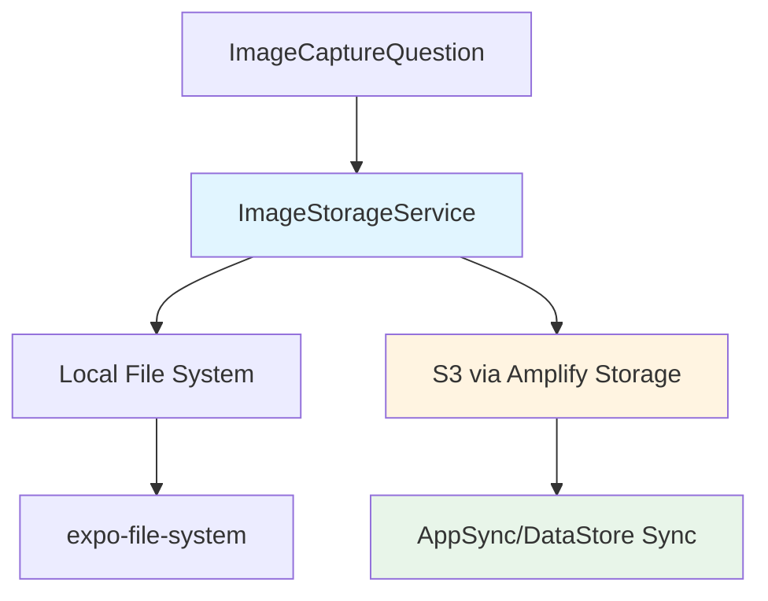
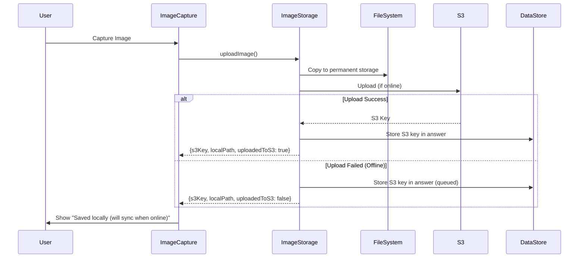
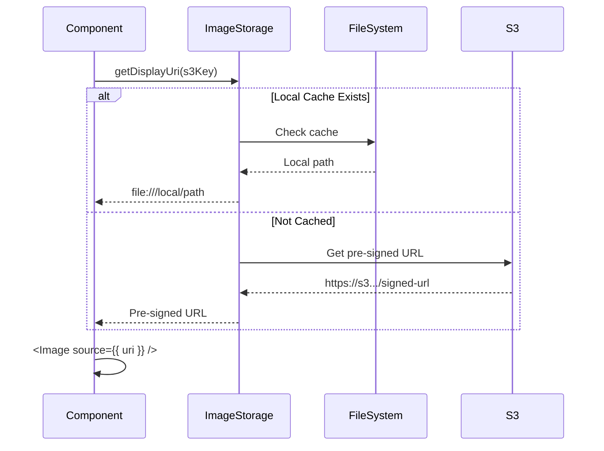

# Image Storage S3 Setup

## Overview

The `ImageStorageService` provides S3-backed image storage with local caching for the task system. Images are uploaded to S3 via Amplify Storage and cached locally using `expo-file-system`. Offline support is handled automatically via AppSync/DataStore sync.

## Architecture



## Components

### ImageStorageService

- **Location:** `packages/task-system/src/services/ImageStorageService.ts`
- **Purpose:** Unified interface for S3 operations with local caching
- **Key Methods:**
  - `uploadImage()` - Upload to S3 with local cache
  - `downloadImage()` - Download from S3 or return cached version
  - `deleteImage()` - Delete from both S3 and local cache
  - `getDisplayUri()` - Get displayable URI (handles S3 keys and local paths)

### File System Utilities

- **Location:** `packages/task-system/src/utils/fileSystemUtils.ts`
- **Purpose:** Local file system operations for image caching
- **Key Functions:**
  - `copyImageToPermanentStorage()` - Copy from temp to permanent storage
  - `createBlobFromLocalFile()` - Create blob from local file URI (React Native compatible)
  - `readImageAsBase64()` - Read image as base64 string
  - `deleteLocalImage()` - Remove from local cache
  - `localImageExists()` - Check cache

### Image Path Utilities

- **Location:** `packages/task-system/src/utils/imagePathUtils.ts`
- **Purpose:** S3 key generation and path management
- **Key Functions:**
  - `generateS3ImageKey()` - Create hierarchical S3 keys
  - `parseS3ImageKey()` - Extract components from S3 key
  - `isS3Key()` / `isLocalFileUri()` - Path type detection

## S3 Configuration

### Adding S3 Storage to Amplify Backend

The Amplify backend currently only has AppSync API configured. To add S3 Storage:

```bash
# Navigate to project root
cd /Users/Kyle.Banashek/Source/orion-task-system

# Add storage category
amplify add storage

# Follow prompts:
# - Resource category: Content (Images, audio, video, etc.)
# - Friendly name: taskSystemImages
# - Bucket name: (accept default or customize)
# - Auth users: read/write access
# - Unauth users: no access (or read-only if needed)
# - Lambda trigger: No

# Push changes to AWS
amplify push
```

### Expected Configuration

After adding storage, `aws-exports.js` should include:

```javascript
const awsmobile = {
  // ... existing config
  aws_user_files_s3_bucket: "taskSystemImages-dev",
  aws_user_files_s3_bucket_region: "us-east-1",
};
```

### S3 Bucket Structure

Images are organized hierarchically:

```
images/
  {organizationId}/
    {studyId}/
      {studyInstanceId}/
        {taskId}_{questionId}_{timestamp}.jpg
```

**Example:**

```
images/org123/study456/instance789/task001_q7_1704211200000.jpg
```

## Integration with ImageCaptureQuestion

### Before (Direct URI Storage)

```typescript
// Old approach - stored local file URI directly
onChange(result.assets[0].uri);
```

### After (S3 Integration)

```typescript
// New approach - upload to S3, store S3 key
const uploadResult = await imageStorageService.uploadImage({
  sourceUri: result.assets[0].uri,
  questionId: question.id,
  taskId: displayProperties?.taskId,
  organizationId: displayProperties?.organizationId,
  studyId: displayProperties?.studyId,
});

// Store S3 key in answer
onChange(uploadResult.s3Key);

// Display from local cache
setImageUri(uploadResult.localPath);
```

## Offline Support

### How It Works

1. **Online:** Image uploads to S3 immediately, S3 key stored in DataStore
2. **Offline:** Image saved locally, S3 key stored in DataStore (queued for sync)
3. **Back Online:** AppSync/DataStore syncs the answer record, image can be uploaded via background job

### Upload Flow



## Display Flow

### Loading Images



## Usage Examples

### Basic Upload

```typescript
import { getImageStorageService } from "@orion/task-system";

const imageStorageService = getImageStorageService();

const result = await imageStorageService.uploadImage({
  sourceUri: "file:///tmp/image.jpg",
  questionId: "q7",
  taskId: "task123",
  organizationId: "org123",
  studyId: "study456",
});

console.log(result.s3Key); // "images/org123/study456/task123_q7_1704211200000.jpg"
console.log(result.uploadedToS3); // true if online, false if offline
```

### Display Image

```typescript
const uri = await imageStorageService.getDisplayUri(
  "images/org123/study456/task123_q7.jpg"
);

<Image source={{ uri }} style={styles.image} />
```

### Delete Image

```typescript
await imageStorageService.deleteImage("images/org123/study456/task123_q7.jpg");
```

## Testing

### Unit Tests

```bash
# Run ImageStorageService tests
yarn test --testPathPattern="ImageStorageService\.test"
```

### Manual Testing

1. **Online Upload:**
   - Capture image
   - Verify uploaded to S3 (check AWS Console)
   - Verify local cache created
   - Verify S3 key stored in answer

2. **Offline Upload:**
   - Turn off network
   - Capture image
   - Verify "Saved locally" message
   - Verify local cache created
   - Turn on network
   - Verify DataStore syncs answer

3. **Display:**
   - Load question with existing image
   - Verify displays from cache (fast)
   - Clear cache
   - Verify fetches from S3 (slower, shows loading)

## Dependencies

### Required Packages

```json
{
  "expo-file-system": "^19.0.21",
  "aws-amplify": "^6.15.5",
  "@aws-amplify/core": "^6.13.1"
}
```

### Amplify CLI

```bash
npm install -g @aws-amplify/cli
amplify configure
```

## Security Considerations

### S3 Bucket Permissions

- **Auth users:** Read/write access to their own images
- **Unauth users:** No access (or read-only if public images needed)
- **Bucket policy:** Restrict to Amplify-generated IAM roles

### Pre-signed URLs

- **Default expiration:** 15 minutes (900 seconds)
- **Customizable:** Pass `expiresIn` to `downloadImage()`
- **Security:** URLs expire automatically, no permanent public access

### Local Cache

- **Storage location:** Device document directory (sandboxed per app)
- **Cleanup:** Manual via `clearAllLocalImages()` or OS storage management
- **Security:** App-sandboxed, not accessible to other apps

## Troubleshooting

### "Storage is not configured"

**Cause:** Amplify Storage not added to backend

**Solution:**

```bash
amplify add storage
amplify push
```

### "Network error" during upload

**Cause:** Offline or S3 unreachable

**Behavior:** Image saved locally, queued for sync

**Resolution:** Automatic when network restored

### Images not displaying

**Cause:** S3 key invalid or pre-signed URL expired

**Solution:**

1. Check S3 key format: `images/{org}/{study}/{file}`
2. Verify image exists in S3
3. Check pre-signed URL expiration (default 15 min)

### Local cache growing too large

**Solution:**

```typescript
import { clearAllLocalImages } from "@orion/task-system";

const deletedCount = await clearAllLocalImages();
console.log(`Cleared ${deletedCount} cached images`);
```

## Future Enhancements

### Background Upload Queue

For offline scenarios, implement a background job to retry failed uploads:

```typescript
// Pseudocode
class ImageUploadQueue {
  async retryFailedUploads() {
    const pendingAnswers = await DataStore.query(TaskAnswer, a =>
      a.uploadedToS3.eq(false)
    );

    for (const answer of pendingAnswers) {
      try {
        await imageStorageService.uploadImage({
          sourceUri: answer.localPath,
          // ... other options
        });

        await DataStore.save(
          TaskAnswer.copyOf(answer, draft => {
            draft.uploadedToS3 = true;
          })
        );
      } catch (error) {
        // Retry later
      }
    }
  }
}
```

### Image Compression

Add compression before upload to reduce bandwidth:

```typescript
import { manipulateAsync, SaveFormat } from "expo-image-manipulator";

const compressed = await manipulateAsync(
  sourceUri,
  [{ resize: { width: 1024 } }],
  { compress: 0.8, format: SaveFormat.JPEG }
);
```

### CDN Integration

For faster global access, add CloudFront CDN in front of S3:

```bash
amplify add hosting
# Select CloudFront + S3
```

## References

- [Amplify Storage Documentation](https://docs.amplify.aws/lib/storage/getting-started/q/platform/js/)
- [expo-file-system Documentation](https://docs.expo.dev/versions/latest/sdk/filesystem/)
- [AppSync Offline Support](https://docs.amplify.aws/lib/datastore/sync/q/platform/js/)
