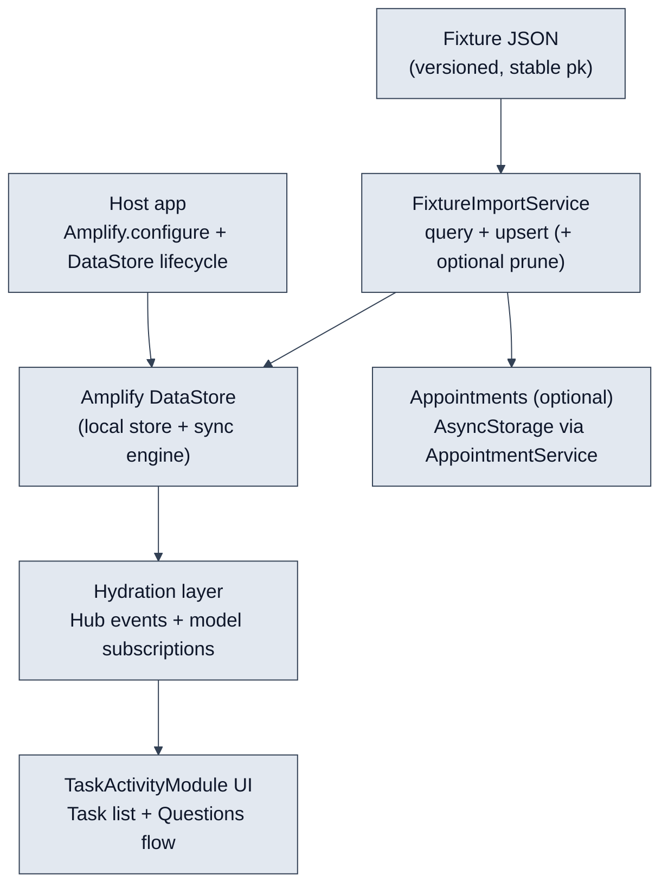
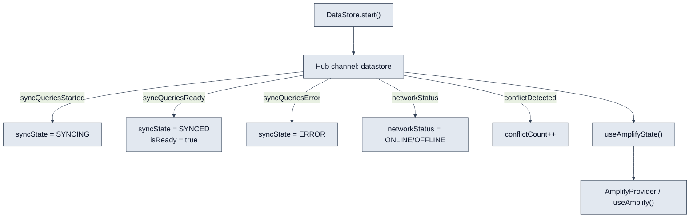
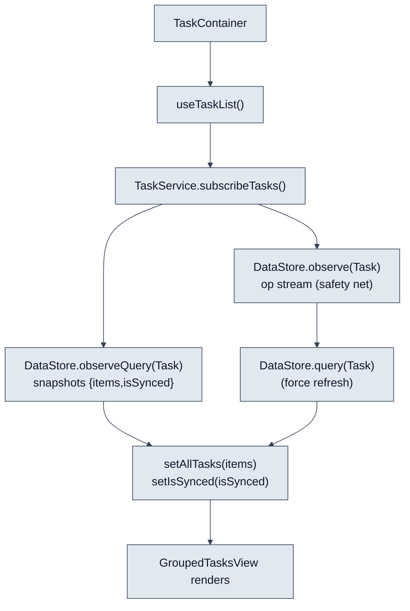
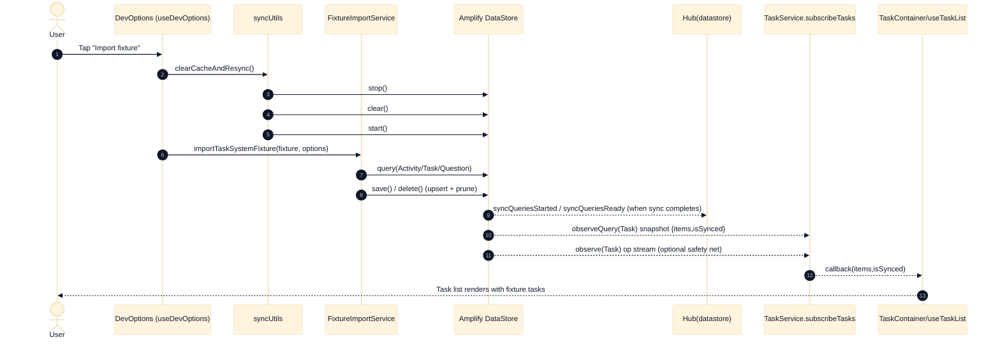

# Task System Fixture Loading & State Hydration

This document explains **how task data is loaded from a JSON fixture** and the **end-to-end data flow** for how the **`@orion/task-system`** runtime/UI becomes hydrated (ready + reactive) using **AWS Amplify DataStore**.

## Table of contents

- [Key concepts](#key-concepts)
- [Primary entrypoints](#primary-entrypoints)
- [Fixture format](#fixture-format)
- [Fixture import flow (DataStore upsert)](#fixture-import-flow-datastore-upsert)
- [Bootstrap + DataStore sync lifecycle](#bootstrap--datastore-sync-lifecycle)
- [Hydration: how UI state is populated and kept fresh](#hydration-how-ui-state-is-populated-and-kept-fresh)
- [Manual sync / reset flows (dev)](#manual-sync--reset-flows-dev)
- [Mermaid diagrams](#mermaid-diagrams)
- [Common failure modes](#common-failure-modes)

## Key concepts

- **Host-owned startup (LX contract)**:
  - The host app calls `Amplify.configure(...)` (once, at startup).
  - The host app decides when `DataStore.start()` / `DataStore.stop()` / `DataStore.clear()` happen.
  - The task-system package configures DataStore-level behavior (e.g. conflict handling), but **does not call `Amplify.configure()`**.
- **Fixture “seed content” is host-owned**:
  - The fixture JSON lives in app source control (example: `src/fixtures/task-system.fixture.v1.json`).
  - The importer turns fixture content into DataStore models so content is editable, offline-capable, and syncs cross-device.
- **Hydration has two layers**:
  - **Global sync readiness** (DataStore hub events → `isReady`/`syncState` in `useAmplifyState`).
  - **Feature subscriptions** (e.g. task list uses `observeQuery` + an additional `observe` “safety net” to keep UI consistent across devices).

## Primary entrypoints

### Harness app (this repo)

- **Synchronous Amplify config**: `src/amplify-init-sync.ts` → `src/amplify-config.ts`
- **Host-owned bootstrap**: `src/bootstrap/taskSystemBootstrap.ts`
- **Global providers**: `app/_layout.tsx` wraps the app with:
  - `TranslationProvider`
  - `AmplifyProvider autoStartDataStore={false}` (because host already starts DataStore)
- **Module UI**: `TaskActivityModule` (`packages/task-system/src/TaskActivityModule.tsx`) mounted from `app/(tabs)/index.tsx`

### Dev “seed/import” entrypoint

- `src/hooks/useDevOptions.ts`
  - imports fixture from disk (`src/fixtures/task-system.fixture.v1.json`)
  - optionally resets local cache (`src/utils/syncUtils.ts`)
  - calls `FixtureImportService.importTaskSystemFixture(...)`

### LX reference implementation

- `src/screens/LXHostExample.tsx` shows the intended host sequence:
  - (optionally) `Amplify.configure(...)` in the host
  - `bootstrapTaskSystem({ startDataStore: true })`
  - (optionally) `FixtureImportService.importTaskSystemFixture(...)`
  - then mount `<TaskActivityModule />`

## Fixture format

The fixture schema is defined in:

- `packages/task-system/src/src/fixtures/TaskSystemFixture.ts`

Key points:

- **Versioned** (`version: 1`)
- **Idempotency is driven by stable `pk` values**, not by `fixtureId`
- Stores:
  - **DataStore models**: `activities[]`, `tasks[]`, optional `questions[]`
  - **Non-DataStore storage**: `appointments?` (stored in AsyncStorage by `AppointmentService`)

Notes:

- The **Questions UI primarily reads questions from `Activity.layouts` / `Activity.activityGroups`** (JSON strings on the Activity model). The optional `questions[]` section exists but is not the primary read path for rendering questions.

## Fixture import flow (DataStore upsert)

The importer is:

- `packages/task-system/src/src/services/FixtureImportService.ts`

### What it does

- Loads existing DataStore content:
  - `DataStore.query(Activity)`, `DataStore.query(Task)`, `DataStore.query(Question)`
- Builds “upsert maps” keyed by **`pk`**
  - Important nuance: DataStore’s backing store primary key is `id`, so **`pk` is not guaranteed unique**.
  - The importer **dedupes by `pk`** and can delete duplicates.
- For each fixture record:
  - If no existing record with that `pk`: create via domain services
    - `ActivityService.createActivity(...)`
    - `TaskService.createTask(...)`
    - `QuestionService.createQuestion(...)`
  - If existing record with that `pk`:
    - Optionally update via `DataStore.save(Model.copyOf(...))`
    - The importer treats identifiers as immutable: it does not overwrite `pk`, `sk`, or `id`.
- Appointments are stored outside DataStore:
  - `AppointmentService.saveAppointments(...)` persists to AsyncStorage

### Pruning modes (destructive)

`importTaskSystemFixture(fixture, options)` supports:

- `pruneNonFixture`
  - Deletes **non-fixture** `Task`/`Activity`/`Question` records
  - Also deletes detected duplicates (same `pk`) and keeps the most recently changed
  - Intention: “fixture is authoritative across devices”
- `pruneDerivedModels`
  - Also deletes: `TaskAnswer`, `TaskResult`, `TaskHistory`, `DataPoint`, `DataPointInstance`
  - Intention: “dev/test reseed with clean slate”

In the dev tooling (`src/hooks/useDevOptions.ts`), fixture import is typically run with:

- `updateExisting: true`
- `pruneNonFixture: true`
- `pruneDerivedModels: true`

## Bootstrap + DataStore sync lifecycle

### 1) Amplify configuration (host-owned)

In this repo, Amplify is configured synchronously before app render:

- `app/_layout.tsx` imports `src/amplify-init-sync.ts`
- `src/amplify-init-sync.ts` calls `configureAmplify()` from `src/amplify-config.ts`
- `src/amplify-config.ts` sets:
  - `DataStore.fullSyncInterval = 10000` (10s safety-net full sync)
  - `aws_appsync_authenticationType` and `aws_appsync_apiKey`

### 2) task-system runtime init + DataStore start (host-owned)

Host bootstraps the package + starts DataStore via:

- `src/bootstrap/taskSystemBootstrap.ts`
  - calls `initTaskSystem({ startDataStore: false })`
  - then (optionally) calls `DataStore.start()`

Inside the package:

- `packages/task-system/src/src/runtime/taskSystem.ts`
  - calls `ConflictResolution.configure()`
  - optionally starts DataStore (if the host asks)

### 3) Global readiness + sync status (Hub events)

`AmplifyProvider` supplies an app-wide “Amplify state”:

- `packages/task-system/src/src/contexts/AmplifyContext.tsx`
  - uses `useAmplifyState(...)`

`useAmplifyState`:

- `packages/task-system/src/src/hooks/useAmplifyState.ts`
  - subscribes to `Hub.listen("datastore", ...)` _before_ starting DataStore (when auto-start is enabled)
  - interprets events like:
    - `syncQueriesStarted` → syncing
    - `syncQueriesReady` → synced + `isReady = true`
    - `syncQueriesError` → error
    - `networkStatus` → online/offline
    - `conflictDetected` → increments conflict counter

In the harness app, `AmplifyProvider autoStartDataStore={false}` is used because the host bootstraps DataStore earlier and gates initial render until ready (`app/_layout.tsx`).

## Hydration: how UI state is populated and kept fresh

Once DataStore is started, there are two complementary mechanisms that hydrate UI:

### A) “Global” hydration: DataStore sync → `useAmplifyState`

- DataStore sync lifecycle events emitted via `Hub` drive:
  - `syncState` (Syncing / Synced / Error)
  - `isReady`
  - network state

This is what powers things like:

- `src/components/SyncStatusBanner.tsx` via `useAmplify()`

### B) “Feature” hydration: subscriptions that feed UI state

#### Task list

- UI → `TaskContainer` → `useTaskContainer` → `useTaskList`
  - `packages/task-system/src/src/components/TaskContainer.tsx`
  - `packages/task-system/src/src/hooks/useTaskContainer.ts`
  - `packages/task-system/src/src/hooks/useTaskList.ts`

Task subscription logic:

- `TaskService.subscribeTasks(...)` (`packages/task-system/src/src/services/TaskService.ts`)
  - Primary stream: `DataStore.observeQuery(Task)` → `{ items, isSynced }`
  - Safety net stream: `DataStore.observe(Task)` → on any op, it does `DataStore.query(Task)` and calls the callback

That two-stream approach is intentional in this codebase to improve **cross-device consistency** (remote updates + deletes).

#### Activity + questions screen

When a user taps a task, `useTaskContainer` navigates with `{ taskId, entityId }`.

On the questions screen:

- `useQuestionsScreen` (`packages/task-system/src/src/hooks/useQuestionsScreen.ts`)
  - loads the task (for status) using `TaskService.getTaskById(taskId)`
  - subscribes to `DataStore.observe(Task)` so task status updates propagate reactively
  - loads activity config + initial answers via `useActivityData(...)`

Activity hydration:

- `useActivityData` (`packages/task-system/src/src/hooks/useActivityData.ts`)
  - loads activity via `useActivity(entityId)`
  - parses `Activity.layouts` + `Activity.activityGroups` (JSON strings) into `ActivityConfig`
  - parses and merges existing answers from `TaskAnswer` models (see below)

Activity subscription:

- `useActivity` (`packages/task-system/src/src/hooks/useActivity.ts`)
  - loads activities via `ActivityService.getActivities()` and finds by `pk` or `id`
  - subscribes via `ActivityService.subscribeActivities(...)`

TaskAnswer hydration (initial answers):

- `useTaskAnswer` (`packages/task-system/src/src/hooks/useTaskAnswer.ts`)
  - subscribes via `TaskAnswerService.subscribeTaskAnswers(...)`
  - `useActivityData` calls `getAnswersByTaskId(taskId)` and parses `TaskAnswer.answer` JSON to seed `initialAnswers`

## Manual sync / reset flows (dev)

The dev tooling intentionally supports aggressive “make devices match” operations:

- `src/utils/syncUtils.ts`
  - `forceFullSync()`: `DataStore.stop()` → `DataStore.start()`
  - `clearCacheAndResync()`: `DataStore.stop()` → `DataStore.clear()` → `DataStore.start()`

Typical dev reseed pattern:

- `clearCacheAndResync()` (wipe local cache)
- import fixture (upsert + prune)
- optionally `forceFullSync()` to encourage cross-device propagation

## Mermaid diagrams

### Data flow overview (fixture → DataStore → hydrated UI)

### Zoom-in: global sync readiness (Hub events → app “ready” state)

### Zoom-in: task list hydration (subscriptions → rendered task list)

### Sequence: import fixture and see tasks appear in UI

## Common failure modes

- **DataStore never becomes “ready”**:
  - In this repo the UI is gated by `bootstrapTaskSystem()` in `app/_layout.tsx`. If that is not called (or fails), hydration won’t happen.
  - If `useAmplifyState` reports `SyncState.Error`, check auth/config (API key, endpoint) and datastore hub events.
- **Calling `Amplify.configure()` multiple times**:
  - The package contract is “host owns Amplify.configure”. Re-configuring can reset auth and break DataStore sync.
  - The harness enforces the pattern by doing it synchronously in `src/amplify-init-sync.ts`.
- **Fixture idempotency issues**:
  - Idempotency depends on stable `pk` values. If `pk` changes between fixture versions, you’ll create new records (and pruning may delete the old ones).
  - Because `pk` is not the DataStore primary key (`id` is), duplicates can exist; the importer explicitly dedupes by `pk`.
- **Appointments “missing”**:
  - Appointments are stored in **AsyncStorage**, not DataStore. If you clear storage or reset app state, reseed via `AppointmentService.saveAppointments(...)` or fixture import (if it contains `appointments`).
