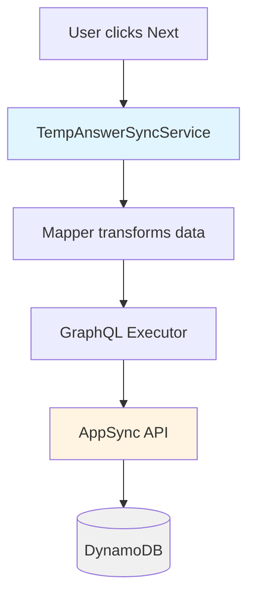
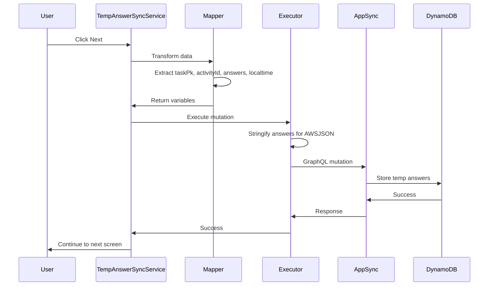

# Package-Owned Temp Answer GraphQL Mutation

## Overview

Implement a package-owned GraphQL mutation `saveTaskTempAnswers` that uses AppSync but is completely independent of LX's existing endpoints. This replaces the current non-existent `saveTempAnswers` mutation and enables proper temp answer saving when users click "Next" in questionnaires.

## Current Problem

The package currently attempts to use a GraphQL mutation that doesn't exist in the AppSync schema:

```
mutation SaveTempAnswers($input: JSON!) { saveTempAnswers(input: $input) }
```

This causes errors:

- `Validation error of type UnknownType: Unknown type JSON`
- `Field 'saveTempAnswers' in type 'Mutation' is undefined`

Temp answers are being queued in the outbox but cannot be synced because the mutation doesn't exist.

## Solution Architecture



## GraphQL Mutation Design

### Package-Owned Mutation

```graphql
mutation SaveTaskTempAnswers(
  $taskPk: String!
  $activityId: String!
  $answers: AWSJSON!
  $localtime: AWSDateTime!
) {
  saveTaskTempAnswers(
    input: {
      taskPk: $taskPk
      activityId: $activityId
      answers: $answers
      localtime: $localtime
    }
  ) {
    taskPk
    activityId
    answers
    localtime
    updatedAt
  }
}
```

### Key Design Decisions

1. **AppSync Native Types**: Uses `AWSJSON` and `AWSDateTime` instead of custom `JSON!` type
2. **Simple Structure**: Only includes fields the package has (task, activity, answers, localtime)
3. **No LX Dependencies**: Independent of LX's complex study/patient/arm structure
4. **Idempotency**: Uses `taskPk` as stable key for deduplication

## Implementation

### 1. Update Bootstrap Configuration

**File**: `src/bootstrap/taskSystemBootstrap.ts`

#### Mutation Document

Replace the current mutation with the new package-owned mutation:

```typescript
TempAnswerSyncService.configure({
  document: `
    mutation SaveTaskTempAnswers(
      $taskPk: String!
      $activityId: String!
      $answers: AWSJSON!
      $localtime: AWSDateTime!
    ) {
      saveTaskTempAnswers(
        input: {
          taskPk: $taskPk
          activityId: $activityId
          answers: $answers
          localtime: $localtime
        }
      ) {
        taskPk
        activityId
        answers
        localtime
        updatedAt
      }
    }
  `,
  // ... executor and mapper
});
```

#### GraphQL Executor

Update executor to handle AppSync types correctly:

```typescript
executor: {
  execute: async ({ document, variables }) => {
    try {
      const client = generateClient();

      // Transform variables for AppSync types
      const appSyncVariables = {
        taskPk: variables.taskPk,
        activityId: variables.activityId,
        answers: JSON.stringify(variables.answers), // AWSJSON requires string
        localtime: variables.localtime, // Already ISO string for AWSDateTime
      };

      const response = await client.graphql({
        query: document,
        variables: appSyncVariables,
      });

      const data = "data" in response ? response.data : undefined;

      return { data };
    } catch (error) {
      return {
        data: undefined,
        errors: [
          error instanceof Error
            ? { message: error.message }
            : { message: String(error) },
        ],
      };
    }
  },
}
```

#### Mapper Function

Ensure mapper provides correct data structure:

```typescript
mapper: ({ task, activity, answers, localtime }) => {
  return {
    stableKey: task.pk, // For deduplication in outbox
    variables: {
      taskPk: task.pk,
      activityId: activity.pk ?? activity.id,
      answers, // Will be stringified in executor
      localtime, // ISO string format (e.g., "2025-12-21T01:23:52.690Z")
    },
  };
};
```

### 2. AppSync Schema Requirements

**Note**: This requires backend/DevOps work to add to AppSync schema.

#### Schema Definition

Add to your AppSync GraphQL schema:

```graphql
type Mutation {
  saveTaskTempAnswers(
    input: SaveTaskTempAnswersInput!
  ): SaveTaskTempAnswersResponse!
}

input SaveTaskTempAnswersInput {
  taskPk: String!
  activityId: String!
  answers: AWSJSON!
  localtime: AWSDateTime!
}

type SaveTaskTempAnswersResponse {
  taskPk: String!
  activityId: String!
  answers: AWSJSON!
  localtime: AWSDateTime!
  updatedAt: AWSDateTime!
}
```

#### Resolver Implementation

Two options for resolver implementation:

**Option 1: Direct DynamoDB Resolver**

Store temp answers in a DynamoDB table (e.g., `TaskTempAnswers`):

- **Partition Key**: `taskPk` (String)
- **Sort Key**: `updatedAt` (String) or use GSI for latest
- **Attributes**: `activityId`, `answers` (JSON), `localtime`

**Option 2: Lambda Resolver**

For additional validation, processing, or business logic:

```typescript
// Lambda resolver example
export const handler = async event => {
  const { taskPk, activityId, answers, localtime } = event.arguments.input;

  // Validate input
  if (!taskPk || !activityId) {
    throw new Error("Missing required fields");
  }

  // Parse answers if needed
  const parsedAnswers =
    typeof answers === "string" ? JSON.parse(answers) : answers;

  // Store in DynamoDB
  await dynamodb
    .put({
      TableName: "TaskTempAnswers",
      Item: {
        taskPk,
        activityId,
        answers: parsedAnswers,
        localtime,
        updatedAt: new Date().toISOString(),
      },
    })
    .promise();

  return {
    taskPk,
    activityId,
    answers: parsedAnswers,
    localtime,
    updatedAt: new Date().toISOString(),
  };
};
```

## Data Flow



## Testing

### Unit Tests

1. **Mapper Tests**: Verify mapper transforms data correctly
   - Test with valid task/activity/answers
   - Test with missing fields
   - Test stableKey generation

2. **Executor Tests**: Test AppSync variable transformation
   - Verify answers are stringified
   - Verify localtime format
   - Test error handling

### Integration Tests

1. **Online Sync**: Test temp save when device is online
2. **Offline Queuing**: Test queuing when device is offline
3. **Retry Logic**: Test automatic retry when network comes back
4. **Error Handling**: Test GraphQL error responses

### E2E Tests

1. **User Flow**: Click Next → Verify temp save → Continue to next screen
2. **Offline Flow**: Go offline → Click Next → Verify queued → Go online → Verify sync
3. **Error Recovery**: Simulate AppSync errors → Verify queuing and retry

## Migration Path

1. **Phase 1**: Backend team adds `saveTaskTempAnswers` mutation to AppSync schema
2. **Phase 2**: Update bootstrap configuration with new mutation
3. **Phase 3**: Test and verify temp save works
4. **Phase 4**: Monitor outbox for any queued items from old mutation
5. **Phase 5**: Clear old outbox items if needed

## Success Criteria

- [ ] Temp answers save successfully when user clicks Next
- [ ] Works offline (queues for later sync)
- [ ] No dependency on LX endpoints
- [ ] Uses AppSync native types (AWSJSON, AWSDateTime)
- [ ] Proper error handling and retry logic
- [ ] All tests passing
- [ ] Documentation complete

## Files Modified

1. **`src/bootstrap/taskSystemBootstrap.ts`**
   - Update mutation document
   - Update executor for AppSync types
   - Verify mapper output

## Dependencies

- AppSync schema must include `saveTaskTempAnswers` mutation (backend work)
- DynamoDB table or Lambda resolver for storing temp answers (backend work)
- Amplify client already configured (existing dependency)

## Notes

- The package remains completely independent - no LX endpoint dependencies
- Backend team needs to implement the AppSync mutation and resolver before this can work
- Current outbox/retry logic remains unchanged - only the mutation changes
- Migration is straightforward: update bootstrap config once AppSync mutation is deployed
