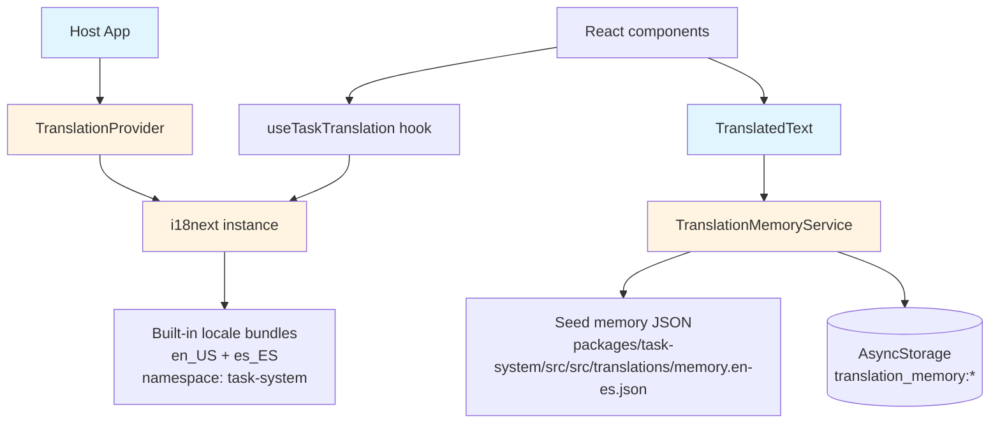
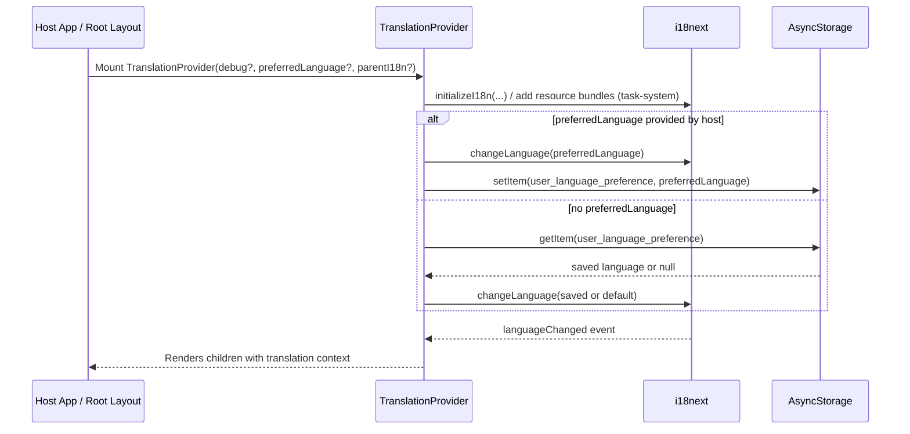
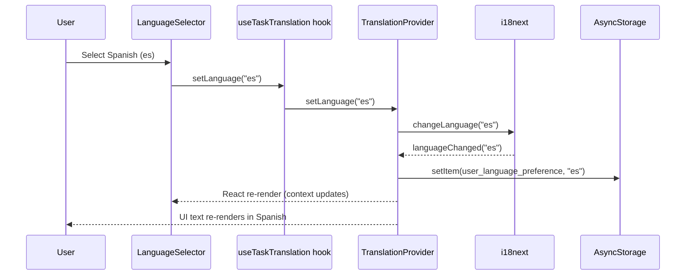

# Translation System (Task System Module)

This document explains how translations work in this repo, starting at a high level (for non-technical readers) and then going into implementation details (for senior developers).

## Table of Contents

- [What gets translated](#what-gets-translated)
- [How the app decides which language to use](#how-the-app-decides-which-language-to-use)
- [High-level architecture](#high-level-architecture)
- [Startup flow (sequence)](#startup-flow-sequence)
- [User changes language (sequence)](#user-changes-language-sequence)
- [Translating text on screen](#translating-text-on-screen)
- [Dynamic text: Translation Memory (task titles, fixtures, free-form strings)](#dynamic-text-translation-memory-task-titles-fixtures-free-form-strings)
- [RTL (Right-to-Left) support](#rtl-right-to-left-support)
- [Debug logging](#debug-logging)
- [Common pitfalls](#common-pitfalls)
- [Adding or updating translations](#adding-or-updating-translations)

## What gets translated

There are two kinds of text you see in the app:

- **UI labels (stable text)**: buttons, headers, error messages, etc.  
  Example: “BEGIN”, “RESUME”, “Select Language”.
- **Dynamic content (user/fixture data)**: task titles, content coming from fixtures, etc.  
  Example: “Episodic Task 01 (All required)”.

We translate these in different ways because they behave differently.

## How the app decides which language to use

The language can come from:

- **Host preference**: the host app can pass `preferredLanguage` into the task module.
- **Saved preference**: if a user selected a language previously, we persist it in AsyncStorage and restore it next time.
- **Default**: English (`en`) is the fallback.

## High-level architecture

At runtime, the translation system is centered around a `TranslationProvider` that owns:

- An **i18next** instance (for key-based UI translations).
- A **language state** that is updated from i18next’s `languageChanged` event (to force React re-renders deterministically).
- Optional **RTL** configuration (layout direction).

Dynamic text (like task titles) can additionally use **Translation Memory** (offline-ready lookup) when a key-based translation doesn’t apply.

## Startup flow (sequence)

This shows what happens when the app starts and mounts the translation system.

## User changes language (sequence)

In the harness, the “Select Language” UI calls `setLanguage(...)` from `useTaskTranslation()`.

## Translating text on screen

For UI labels, code should use translation keys with i18next:

- The app uses a **single namespace**: `task-system`
- Keys are written as: `task.begin`, `common.ok`, `questions.validationError`, etc.
- The hook `useTaskTranslation()` provides a `t()` helper that automatically prefixes the namespace.

Examples:

- `t("task.begin")` → “BEGIN” (English) / “COMENZAR” (Spanish)
- `t("common.cancel")` → “CANCEL” / “CANCELAR”

## Dynamic text: Translation Memory (task titles, fixtures, free-form strings)

Many task titles are not “UI labels”; they’re dynamic strings coming from fixture data or user content. For these:

- We **do not** expect a stable translation key to exist.
- We do an **offline lookup** using Translation Memory.

The `TranslatedText` component implements this strategy:

- **If a key exists** (explicit `translationKey` prop or a known mapping), use i18next.
- **Otherwise**, if the current language isn’t English, try `TranslationMemoryService.getTranslationSync(...)`.
- If no translation exists, show the original text.

Detailed Translation Memory documentation lives here:

- [Translation Memory (Offline-Ready i18n Strategy)](DOCS/features/translation-memory.md)

## RTL (Right-to-Left) support

When RTL is enabled:

- `TranslationProvider` checks whether the active language is RTL.
- If needed, it updates React Native’s `I18nManager` to force RTL layout.
- `TranslatedText` also applies RTL-aware text alignment (right aligned) for readability.

## Debug logging

We keep translation debug logs behind a functional switch:

- `TranslationProvider` accepts a `debug` prop.
- That flag is passed into i18next’s own `debug` option.
- High-volume logs (e.g. per-render logs in `TranslatedText`) check the i18next debug flag and only emit when enabled.

This allows turning on verbose tracing during debugging without spamming production logs.

## Common pitfalls

- **Accidentally mounting two `TranslationProvider`s**:
  - This creates “split brain” language state because each provider can create its own i18n instance.
  - Symptoms: language selector “works” but parts of the UI don’t update.
  - Fix: ensure only one provider is mounted; the task module (`TaskActivityModule`) avoids mounting another provider if one already exists.

- **Using dynamic strings as keys**:
  - UI keys should be stable (`task.begin`), not runtime text (`"Begin"`).
  - For dynamic strings (titles), rely on Translation Memory instead.

## Adding or updating translations

For UI labels:

- **Add/modify English**: `packages/task-system/src/src/translations/locales/en_US.ts`
- **Add/modify Spanish**: `packages/task-system/src/src/translations/locales/es_ES.ts`
- Keep keys stable and namespaced under `task`, `activity`, `common`, `questions`.

For dynamic titles / fixture content:

- Add an entry to seed memory:
  - `packages/task-system/src/src/translations/memory.en-es.json`
  - Example entry: `"Sample Task 3 (Fixture)": "Tarea de ejemplo 3 (Fixture)"`
