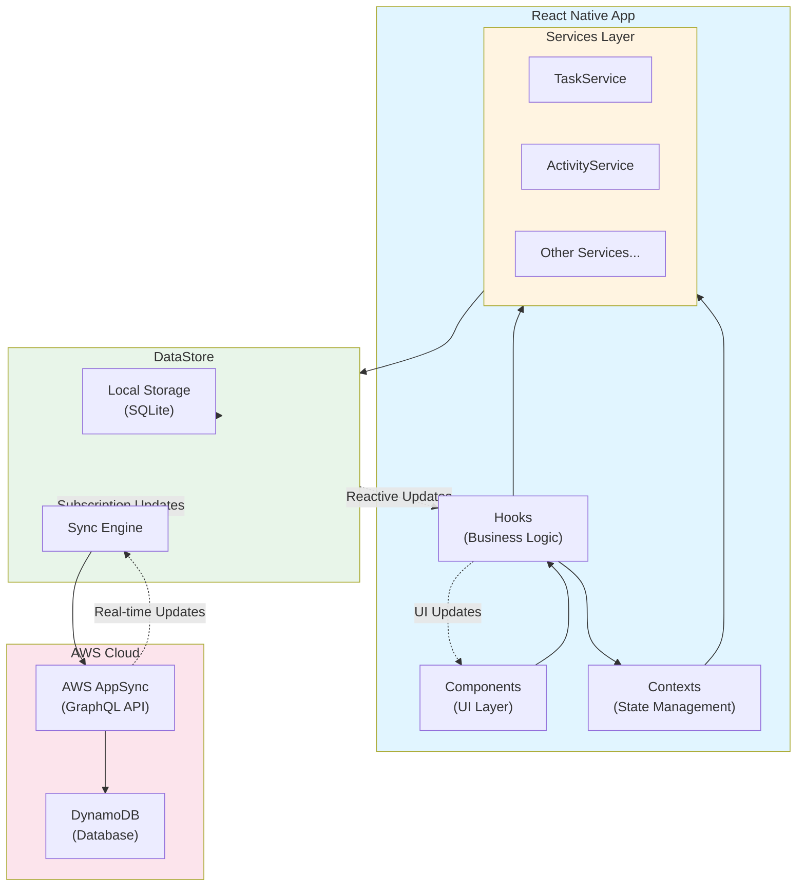
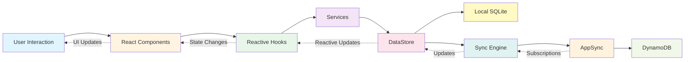
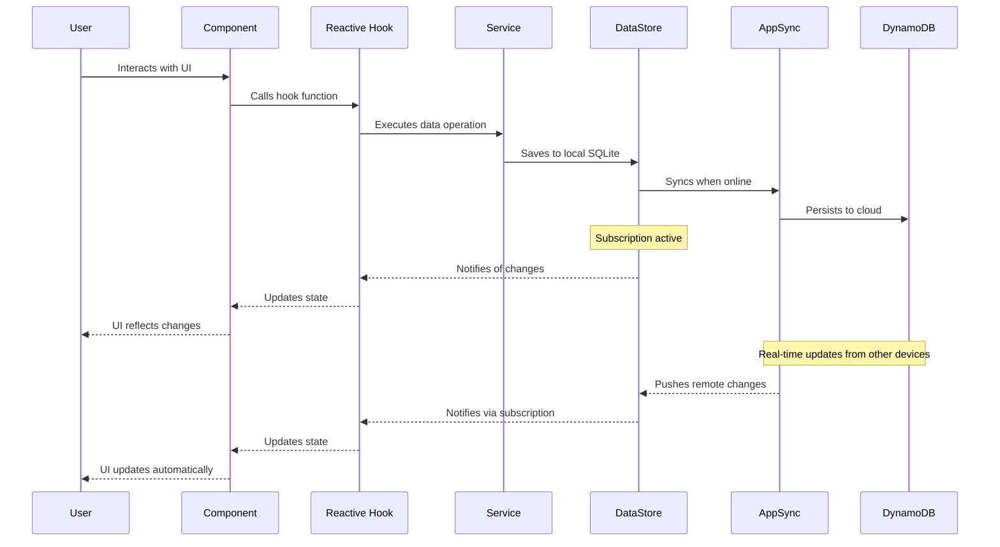

# ✨ LX App Sync POC - Amplify DataStore Task Management App ✨

A React Native application built with Expo and AWS Amplify that demonstrates online/offline synchronization capabilities using DataStore with SQLite as the storage adapter. This POC showcases task management, dynamic question rendering, and data point recording for health assessment workflows. Perfect for building resilient apps that work anywhere! 🚀


_The app running on iOS devices showing task management, question forms, and online/offline sync capabilities_

## ✅ Features

- 📋 **Task Management**: Create, view, and manage tasks with due dates and status tracking
- 📝 **Dynamic Question Forms**: Multi-page questionnaires with various question types (text, single/multi-select, numeric scale, date)
- 📊 **Data Point Recording**: Automatic recording of answers as DataPointInstance records for analytics
- 🔄 **Offline-First Architecture**: Seamless synchronization with AWS AppSync
- 📶 **Visual Indicators**: Network and sync status indicators
- 🎨 **Component Architecture**: Clean separation of logic (hooks) and presentation (components)
- 🛡️ **TypeScript**: Full type safety throughout the application
- ☁️ **AWS AppSync Backend**: GraphQL API with real-time subscriptions
- 🔍 **Smart Conflict Resolution**: Custom conflict resolution for data consistency
- 📱 **Multi-Screen Activities**: Support for introduction, question pages, review, and completion screens
- 🌍 **Multi-Language Support**: Real-time translation using AWS Translate with 20+ supported languages
- 🔄 **RTL Language Support**: Automatic Right-to-Left layout for Arabic, Hebrew, Urdu, Persian, and Yiddish

## 💻 Prerequisites

- 🔍 Node.js (v14 or later)
- 💾 npm or yarn
- 📱 Expo CLI (`npm install -g expo-cli`)
- ☁️ AWS Account (for backend services)
- 🔨 AWS Amplify CLI (`npm install -g @aws-amplify/cli`)

## 📍 Setup Instructions

### 1. 💼 Clone the repository

```bash
git clone <repository-url>
cd amplify-datastore-todo
```

### 2. 📦 Install dependencies

```bash
npm install
```

### 3. ☁️ Pull the existing Amplify backend

```bash
amplify pull --appId d19l3dxjz56ge3 --envName dev
```

Follow the prompts to configure the Amplify backend. This will create the necessary `aws-exports.js` file.

### 4. 🚀 Start the app

```bash
npm start
```

In the output, you'll find options to open the app in a:

- [Android emulator](https://docs.expo.dev/workflow/android-studio-emulator/)
- [iOS simulator](https://docs.expo.dev/workflow/ios-simulator/)
- [Expo Go](https://expo.dev/go) on your physical device

## Project Structure

```
/amplify-datastore-todo
├── app/                    # Expo Router app directory
│   ├── (tabs)/            # Tab-based navigation
│   │   ├── index.tsx      # Main tasks screen with task creation
│   │   ├── dashboard-sim.tsx  # Dashboard view (read-only)
│   │   ├── questions.tsx  # Dynamic question rendering screen
│   │   └── seed-screen.tsx  # Data seeding interface
│   └── _layout.tsx        # App layout configuration
├── models/                # Amplify generated models
├── scripts/               # Utility scripts
│   ├── seed-question-data.ts  # Seed script for activities and tasks
│   └── version-bump.sh   # Version bumping automation
├── src/
│   ├── amplify-config.ts  # Amplify configuration
│   ├── API.ts            # Generated TypeScript types from GraphQL schema
│   ├── components/        # UI components
│   │   ├── NetworkStatusIndicator.tsx
│   │   ├── TasksGroupedView.tsx  # Task list grouped by date/time
│   │   ├── TaskCard.tsx  # Individual task card component
│   │   └── questions/     # Question rendering components
│   │       ├── QuestionRenderer.tsx
│   │       ├── TextQuestion.tsx
│   │       ├── SingleSelectQuestion.tsx
│   │       ├── MultiSelectQuestion.tsx
│   │       ├── NumberQuestion.tsx
│   │       ├── DateQuestion.tsx
│   │       ├── IntroductionScreen.tsx
│   │       ├── CompletionScreen.tsx
│   │       ├── ReviewScreen.tsx
│   │       ├── NavigationButtons.tsx
│   │       └── ProgressIndicator.tsx
│   ├── contexts/
│   │   └── AmplifyContext.tsx  # Amplify context provider
│   ├── graphql/          # Generated GraphQL operations
│   │   ├── mutations.ts  # GraphQL mutation operations
│   │   ├── queries.ts    # GraphQL query operations
│   │   └── subscriptions.ts # GraphQL subscription operations
│   ├── hooks/            # Custom React hooks (business logic)
│   │   ├── useAmplifyState.ts # Amplify state management
│   │   ├── useNetworkStatus.ts # Network status logic
│   │   ├── useTaskForm.ts # Task form logic
│   │   ├── useTaskList.ts # Task list logic (reactive subscription)
│   │   ├── useTaskUpdate.ts # Reactive task updates
│   │   ├── useGroupedTasks.ts # Task grouping logic
│   │   ├── useActivity.ts # Single activity fetching (reactive)
│   │   ├── useActivityList.ts # Activity list (reactive subscription)
│   │   ├── useTaskAnswer.ts # Task answer management (reactive)
│   │   ├── useTaskAnswerList.ts # Task answer list (reactive subscription)
│   │   ├── useDataPointInstance.ts # Data point instance management (reactive)
│   │   ├── useDataPointList.ts # Data point list (reactive subscription)
│   │   ├── useQuestionList.ts # Question list (reactive subscription)
│   │   └── useQuestionsScreen.ts # Questions screen logic
│   ├── services/         # Data services (data access layer)
│   │   ├── TaskService.ts  # Task CRUD operations
│   │   ├── ActivityService.ts  # Activity operations
│   │   ├── QuestionService.ts  # Question operations
│   │   ├── TaskAnswerService.ts  # Task answer operations
│   │   ├── TaskResultService.ts  # Task result operations
│   │   ├── TaskHistoryService.ts  # Task history operations
│   │   ├── DataPointService.ts  # Data point operations
│   │   └── ConflictResolution.ts  # Centralized conflict resolution
│   ├── types/            # TypeScript type definitions
│   │   ├── ActivityConfig.ts  # Activity JSON structure types
│   │   └── Task.ts  # Task type definitions
│   └── utils/            # Utility functions
│       └── activityParser.ts  # Activity JSON parser
└── aws-exports.js         # AWS configuration (generated by Amplify CLI)
```

## 📱 Key Features

### Task Management

- Create tasks with due dates and times
- Tasks grouped by day and time
- Status tracking (OPEN, STARTED, INPROGRESS, COMPLETED)
- Task type icons for visual identification
- BEGIN/RESUME buttons based on task status

### Dynamic Question Rendering

- Multi-page questionnaires with introduction, question pages, review, and completion screens
- Support for various question types:
  - Text input (single-line and multi-line)
  - Single select (radio buttons)
  - Multi-select (checkboxes)
  - Numeric scale (slider)
  - Date picker
- Form validation with required field checking
- Progress indicators for multi-page activities
- Answer persistence and restoration

### Data Point Recording

- Automatic creation of `DataPointInstance` records when answers are submitted
- Links answers to activities and questions for analytics
- Synchronized with AWS AppSync for cloud storage

### Component Architecture

- **Hooks contain all business logic**: State management, side effects, API calls
- **Reactive data management**: Hooks subscribe to DataStore changes for real-time updates
- **Components are presentation-only**: Render UI and handle user interactions
- **Small, focused components**: Each component has a single responsibility
- **Reusable sub-components**: Shared UI elements across screens
- **Service layer**: Services provide data access, hooks provide reactive state management

## 📱 Testing Offline Functionality

1. 🔍 Create a few tasks while online
2. ✈️ Turn off your device's network connection (airplane mode or disable Wi-Fi/cellular)
3. 📝 Create more tasks and answer questions while offline
4. 📶 Turn your network connection back on
5. ✨ Watch as the sync indicator changes and your offline data syncs with the backend

## 🔧 Troubleshooting

- 🗑️ If you encounter issues with DataStore synchronization, try clearing the local database:

  ```javascript
  // In your app code, add this for testing:
  await DataStore.clear();
  ```

- 🔄 Ensure you have the latest version of the Amplify CLI installed

- 🔍 If you see "VirtualizedLists should never be nested" warnings, make sure FlatList components aren't nested inside ScrollView components with the same orientation

- ⚠️ If you encounter "Amplify has not been configured" warnings, check that Amplify is initialized before any component tries to use it (see our custom entry.js approach)

## 👏 Implementation Highlights

### 🏗️ Component Architecture Pattern

This app follows a strict separation of concerns:

**Hooks (`src/hooks/`)**: Contain all business logic

- State management (`useState`, `useReducer`)
- Side effects (`useEffect`, subscriptions)
- Reactive data subscriptions (DataStore observeQuery)
- API calls and data operations
- Event handlers with logic
- Validation and data transformation

**Reactive Hooks Pattern:**

- **List hooks** (e.g., `useTaskList`, `useActivityList`): Subscribe to all records, provide filtering
- **Single item hooks** (e.g., `useActivity`): Subscribe to a specific record by ID
- **Mutation hooks** (e.g., `useTaskUpdate`, `useTaskAnswer`): Provide create/update operations with reactive updates
- **Composite hooks** (e.g., `useQuestionsScreen`): Combine multiple hooks for complex workflows

**Components (`src/components/`, `app/`)**: Handle presentation only

- Render UI based on props
- Handle user interactions (pass to hooks)
- Compose smaller sub-components
- No business logic in components

**Example Pattern:**

```typescript
// ❌ Bad: Large component with all logic
export default function MyComponent() {
  const [state, setState] = useState(...);
  useEffect(() => { ... }, []);
  const handleSubmit = async () => { ... };
  // 500+ lines of logic and JSX
}

// ✅ Good: Hook contains logic, component renders
// src/hooks/useMyComponent.ts
export const useMyComponent = () => {
  const [state, setState] = useState(...);
  useEffect(() => { ... }, []);
  const handleSubmit = async () => { ... };
  return { state, handleSubmit, ... };
};

// app/(tabs)/my-component.tsx
export default function MyComponent() {
  const { state, handleSubmit } = useMyComponent();
  return <View>...</View>;
}
```

**Reactive Data Pattern:**

```typescript
// ✅ Good: Use hooks for reactive data, not direct service calls
// src/hooks/useTaskUpdate.ts
export const useTaskUpdate = () => {
  const [isUpdating, setIsUpdating] = useState(false);
  const updateTask = useCallback(async (id, data) => {
    setIsUpdating(true);
    try {
      await TaskService.updateTask(id, data);
      // Subscription automatically updates UI
    } finally {
      setIsUpdating(false);
    }
  }, []);
  return { updateTask, isUpdating };
};

// ❌ Bad: Direct service calls in components
export default function TaskCard({ task }) {
  const handleUpdate = async () => {
    await TaskService.updateTask(task.id, { status: "STARTED" });
    // No reactive updates, need manual refresh
  };
}
```

### 💡 Custom Amplify Initialization

This app uses a custom entry point to ensure Amplify is properly configured before any component tries to use it:

```javascript
// entry.js - Custom entry point for the app
import { Amplify } from "aws-amplify";
import awsconfig from "./aws-exports";
import "expo-router/entry";

// Configure Amplify immediately
console.log("Entry point: Initializing Amplify before Expo Router loads...");
Amplify.configure(awsconfig);
console.log("Entry point: Amplify initialized successfully");
```

This approach solves the common "Amplify has not been configured" warning in Expo Router apps by ensuring Amplify is initialized before any other code runs.

### 🧹 Clean UI Implementation

The app follows React Native best practices for list rendering:

- Avoids nesting `FlatList` inside `ScrollView` with the same orientation
- Uses separate View components for form and list sections
- Implements proper keyboard handling for form inputs

### 🔧 Smart Conflict Resolution

The app implements a sophisticated conflict resolution strategy for DataStore:

```typescript
// Custom conflict handler for DataStore
DataStore.configure({
  conflictHandler: async ({
    modelConstructor,
    localModel,
    remoteModel,
    operation,
  }) => {
    console.log("Conflict detected for model", modelConstructor.name);
    console.log("Local model: ", localModel);
    console.log("Remote model: ", remoteModel);
    console.log("Operation:", operation, "Attempts:", attempts);

    // Special handling for DELETE operations
    if (operation === OpType.DELETE) {
      // If remote is already deleted, use it
      if (remoteModel?._deleted) {
        console.log("Remote already deleted, using remote model");
        return remoteModel;
      }

      // If local model is incomplete but remote exists, use remote with delete flag
      if (!localModel?.name && remoteModel) {
        console.log(
          "Local model incomplete, using remote model with delete flag"
        );
        return {
          ...remoteModel,
          _deleted: true,
        };
      }

      // Otherwise use local delete
      console.log("Using local delete");
      return localModel;
    }

    // For other operations, merge changes
    return remoteModel;
  },
});
```

This approach prevents infinite retry loops and handles edge cases gracefully.

## 📚 Amplify Codegen

This project uses AWS Amplify's codegen feature to automatically generate TypeScript types and GraphQL operations from the GraphQL schema. The configuration is in `.graphqlconfig.yml`.

### 📁 Generated Files

- **`src/API.ts`**: 📝 Contains TypeScript interfaces for all GraphQL types, including:

  - Model interfaces (Task, Activity, Question, TaskAnswer, etc.)
  - Input types (CreateTaskInput, UpdateTaskInput, etc.)
  - Query/Mutation response types
  - Enums and scalars

- **`src/graphql/`**: 📚 Contains GraphQL operation strings:
  - `queries.ts`: GraphQL query operations (getTask, listTasks, etc.)
  - `mutations.ts`: GraphQL mutation operations (createTask, updateTask, deleteTask, etc.)
  - `subscriptions.ts`: GraphQL subscription operations (onCreateTask, onUpdateTask, onDeleteTask, etc.)

### ✨ Benefits

- **🛡️ Type Safety**: Full TypeScript typing for all GraphQL operations
- **🔄 Automatic Updates**: When the schema changes, running codegen updates all types and operations
- **💡 Reduced Boilerplate**: No need to manually write GraphQL operations
- **💯 Consistency**: Ensures all operations follow the same patterns

### 🔄 Updating Generated Files

🔄 To update the generated files after schema changes:

```bash
amplify codegen
```

## ☁️ AWS Architecture Overview

This application uses several AWS technologies working together to provide a seamless offline-first experience. Here's an explanation of the key components and how they interact:

### Architecture Diagram



### Key AWS Technologies

#### AWS Amplify

AWS Amplify is the framework that ties everything together. It provides:

- **CLI Tools**: For creating and managing backend resources
- **Client Libraries**: For connecting the React Native app to AWS services
- **Hosting**: For deploying web applications (not used in this mobile app)
- **Authentication**: For user management (not currently implemented but could be added)

In our app, Amplify is configured in `src/amplify-config.ts` and provides the connection to all AWS services.

#### AWS AppSync

AppSync is AWS's managed GraphQL service that acts as the API layer:

- **GraphQL API**: Provides a single endpoint for all data operations
- **Real-time Data**: Enables subscriptions for live updates
- **Schema Definition**: Defines the data model using GraphQL SDL
- **Resolvers**: Connect GraphQL operations to data sources

Our app uses AppSync as the backend API, with the schema defined in `amplify/backend/api/lxtodoapp/schema.graphql`.

#### DataStore

DataStore is Amplify's solution for offline-first data management:

- **Local Storage**: Persists data locally using SQLite
- **Sync Engine**: Handles synchronization with the cloud when online
- **Conflict Resolution**: Manages conflicts between local and remote changes
- **Real-time Updates**: Subscribes to changes and updates the UI

In our app, services like `TaskService.ts`, `ActivityService.ts`, and `TaskAnswerService.ts` use DataStore for all data operations, enabling offline functionality.

#### How They Work Together



**Detailed Flow:**

1. **User Interaction**: User interacts with React components
2. **Component Logic**: Components use hooks for business logic
3. **Reactive Hooks**: Hooks subscribe to DataStore changes for real-time updates
4. **Data Operations**: Hooks call service methods (e.g., TaskService, ActivityService, TaskAnswerService)
5. **Local Storage**: DataStore saves changes to local SQLite database
6. **Background Sync**: When online, DataStore syncs with AppSync
7. **Cloud Storage**: AppSync persists data to DynamoDB
8. **Real-time Updates**: Changes from other devices come back through subscriptions
9. **Automatic UI Updates**: Hooks receive subscription updates and trigger component re-renders

#### DataStore Conflict Resolution

This app implements a custom conflict resolution strategy for handling synchronization conflicts between local and remote changes:

```typescript
// Custom conflict handler in ConflictResolution.ts
DataStore.configure({
  conflictHandler: async ({
    modelConstructor,
    localModel,
    remoteModel,
    operation,
  }) => {
    const modelName = modelConstructor.name;

    // For Task model conflicts during updates
    if (modelName === "Task" && operation === OpType.UPDATE) {
      // Prefer local status changes, but remote timing updates
      const resolvedModel = {
        ...remoteModel, // Start with remote model as base
        status: localModel.status || remoteModel.status, // Prefer local status
        startTimeInMillSec:
          remoteModel.startTimeInMillSec || localModel.startTimeInMillSec,
        expireTimeInMillSec:
          remoteModel.expireTimeInMillSec || localModel.expireTimeInMillSec,
        activityAnswer: localModel.activityAnswer || remoteModel.activityAnswer,
      };
      return resolvedModel;
    }

    // For delete operations, handle incomplete local models
    if (operation === OpType.DELETE) {
      if (remoteModel._deleted) {
        return remoteModel;
      }
      // If local model is incomplete, use remote with delete flag
      let isIncomplete = false;
      if (modelName === "Task") {
        isIncomplete = !localModel.title && !localModel.description;
      } else if (modelName === "Question") {
        isIncomplete = !localModel.question && !localModel.questionId;
      } else if (modelName === "Activity") {
        isIncomplete = !localModel.name && !localModel.title;
      } else {
        isIncomplete = !localModel.pk && !localModel.sk;
      }
      if (isIncomplete) {
        return { ...remoteModel, _deleted: true };
      }
      return localModel;
    }

    // Default to remote model for other cases
    return remoteModel;
  },
});
```

**How Conflicts Are Handled:**

1. **Detection**: DataStore detects when the same record has been modified both locally and remotely
2. **Custom Logic**: Our conflict handler applies specific merge rules:
   - For Task updates:
     - Prefer local status changes
     - Prefer remote timing updates (startTimeInMillSec, expireTimeInMillSec)
     - Prefer local activityAnswer if it exists
   - For deletions: Handle incomplete local models gracefully
   - For other models: Default to remote changes
3. **Tracking**: The app tracks conflict occurrences via the `conflictCount` in `useAmplifyState`
4. **Logging**: All conflicts are logged to the console with details for debugging

### Other AWS Services Used

- **DynamoDB**: NoSQL database that stores Task, Activity, Question, TaskAnswer, and other data
- **IAM**: Manages permissions and access control
- **CloudFormation**: Provisions and manages AWS resources (used by Amplify CLI)
- **Lambda Functions**: While not directly visible in our code, AppSync can use Lambda functions for resolvers

#### DynamoDB Table Naming Convention

AWS Amplify DataStore creates DynamoDB tables with a specific naming pattern: `{ModelName}-{AppSyncAPIId}-{Environment}` (e.g., `Task-yvqxlqmf2ndqjnb2oytn22mgei-dev`).

This convention ensures uniqueness across Amplify apps, supports multi-environment deployments, and follows AWS standards. The AppSync API ID is stored in `amplify/backend/amplify-meta.json`.

📖 **For detailed information**, see [AWS Technical Details](DOCS/aws-technical-details.md#dynamodb-table-naming-convention).

#### AppSync Resolvers and Lambda

In our current implementation, AppSync uses default VTL (Velocity Template Language) resolvers to connect GraphQL operations to DynamoDB. These are not Lambda functions but rather template scripts that AppSync executes.

However, for more complex operations, you can configure AppSync to use Lambda functions as resolvers. This would allow you to:

- Implement complex business logic
- Integrate with other AWS services
- Perform data validation and transformation
- Access multiple data sources in a single operation

To add a Lambda resolver, you would use the Amplify CLI:

```bash
amplify add function
amplify update api # to connect the function as a resolver
```

### Potential Future AWS Integrations

#### Cognito Authentication Example

Here's how you could integrate Amazon Cognito for authentication (this code is for reference only and is commented out):

```typescript
// src/auth-config.ts
// NOTE: This is an example and is NOT currently implemented

import { Amplify, Auth } from "aws-amplify";
import awsconfig from "../aws-exports";

// Configure Amplify with authentication
export const configureAmplifyWithAuth = () => {
  // Add auth configuration to existing config
  const authConfig = {
    ...awsconfig,
    oauth: {
      domain: "your-cognito-domain.auth.region.amazoncognito.com",
      scope: ["email", "profile", "openid"],
      redirectSignIn: "myapp://callback/",
      redirectSignOut: "myapp://signout/",
      responseType: "code",
    },
  };

  Amplify.configure(authConfig);
};

// Example auth hook
export const useAuth = () => {
  const [user, setUser] = useState(null);
  const [loading, setLoading] = useState(true);

  useEffect(() => {
    // Check current auth state
    const checkUser = async () => {
      try {
        const userData = await Auth.currentAuthenticatedUser();
        setUser(userData);
      } catch (e) {
        setUser(null);
      } finally {
        setLoading(false);
      }
    };

    checkUser();

    // Listen for auth events
    const listener = Hub.listen("auth", ({ payload }) => {
      const { event } = payload;
      if (event === "signIn") {
        checkUser();
      } else if (event === "signOut") {
        setUser(null);
      }
    });

    return () => Hub.remove("auth", listener);
  }, []);

  const signIn = () => Auth.federatedSignIn();
  const signOut = () => Auth.signOut();

  return { user, loading, signIn, signOut };
};
```

To implement this, you would:

1. Run `amplify add auth` to add Cognito to your project
2. Configure authentication settings as needed
3. Integrate the auth hook into your app
4. Add protected routes based on authentication state

#### Other Potential AWS Integrations

- **S3**: For file storage (e.g., attaching images to tasks or activities)
- **CloudWatch**: For monitoring and logging
- **Pinpoint**: For analytics and push notifications
- **API Gateway**: For REST APIs if needed alongside GraphQL

## 🧪 Testing

This project includes comprehensive unit tests for hooks and services:

```bash
# Run all tests
npm test

# Run tests in watch mode
npm run test:watch

# Run tests with coverage
npm run test:coverage

# Generate HTML coverage report
npm run test:coverage:html
```

### Test Coverage

- **Services**: Full CRUD and subscription tests for all services
- **Hooks**: Tests for state management, subscriptions, and business logic
- **Components**: Tests for rendering and user interactions

### Test Structure

- Service tests: `src/services/__tests__/`
- Hook tests: `src/hooks/__tests__/`
- Component tests: `src/components/__tests__/`

## 🔄 Version Management

This project uses semantic versioning with automated version bumping:

```bash
# Use the Cursor command
/version-bump.cursor

# Or run directly
.cursor/commands/version-bump.sh [patch|minor|major] "Commit message"
```

The version bump script:

- Detects current version from branch name
- Validates commit message is meaningful
- Creates new version branch
- Commits all changes
- Pushes to origin

## 📊 Data Models

### Core Models

- **Task**: Represents user tasks with due dates, status, and activity links
- **Activity**: Defines questionnaire structure with JSON configuration
- **Question**: Individual questions within activities
- **TaskAnswer**: Stores user answers to questions
- **TaskResult**: Records task completion results
- **TaskHistory**: Tracks task status changes and history
- **DataPoint**: Defines data point schemas
- **DataPointInstance**: Records data points for analytics and reporting

### Data Flow



**Step-by-step flow:**

1. User creates/views tasks (via `useTaskList` hook - reactive)
2. User clicks task to start questionnaire
3. System loads Activity configuration (via `useActivity` hook - reactive)
4. User answers questions across multiple screens
5. Answers saved as TaskAnswer records (via `useTaskAnswer` hook - reactive)
6. DataPointInstance records created for analytics (via `useDataPointInstance` hook - reactive)
7. Task status updated via `useTaskUpdate` hook (OPEN → STARTED → INPROGRESS → COMPLETED)

### Reactive Data Management

All data operations use reactive hooks that subscribe to DataStore changes:

- **List Hooks**: `useTaskList`, `useActivityList`, `useTaskAnswerList`, `useDataPointList`, `useQuestionList`

  - Subscribe to all records of a type
  - Automatically update when data changes
  - Provide filtering and search capabilities

- **Single Item Hooks**: `useActivity`

  - Subscribe to a specific record by ID
  - Automatically update when that record changes

- **Mutation Hooks**: `useTaskUpdate`, `useTaskAnswer`, `useDataPointInstance`

  - Provide create/update operations
  - Changes automatically propagate via subscriptions
  - Include loading and error states

- **Composite Hooks**: `useQuestionsScreen`
  - Combine multiple hooks for complex workflows
  - Coordinate data from multiple sources
  - Manage complex state interactions

## 🌍 Translation & RTL Support

The app includes comprehensive internationalization support:

- **20+ Languages**: Support for major languages including English, Spanish, French, German, Arabic, Hebrew, and more
- **Real-Time Translation**: Uses AWS Translate to translate all user-facing text
- **RTL Support**: Automatic Right-to-Left layout for RTL languages (Arabic, Hebrew, Urdu, Persian, Yiddish)
- **Language Persistence**: Selected language preference is saved and restored on app reload
- **Caching**: Translations are cached locally to minimize API calls and improve performance

### Using Translation

All user-facing text is automatically translated based on the selected language. Components use the `TranslatedText` component or `useTranslatedText` hook:

```typescript
import { TranslatedText } from "../components/TranslatedText";
import { useTranslatedText } from "../hooks/useTranslatedText";

// Component approach
<TranslatedText text="Hello World" style={styles.text} />

// Hook approach
const { translatedText } = useTranslatedText("Hello World");
```

### RTL Support

RTL languages automatically:
- Flip layout direction (margins, padding, borders)
- Adjust text alignment
- Reverse icon directions (e.g., chevron arrows)
- Update flex layouts

For detailed RTL implementation guide, see [RTL Support Documentation](DOCS/rtl-support.md).

## Learn More

- [AWS Amplify Documentation](https://docs.amplify.aws/)
- [Amplify Codegen Documentation](https://docs.amplify.aws/cli/graphql/codegen/)
- [DataStore Documentation](https://docs.amplify.aws/lib/datastore/getting-started/q/platform/js/)
- [AppSync Documentation](https://docs.aws.amazon.com/appsync/)
- [Expo Documentation](https://docs.expo.dev/)
- [React Native Documentation](https://reactnative.dev/)
