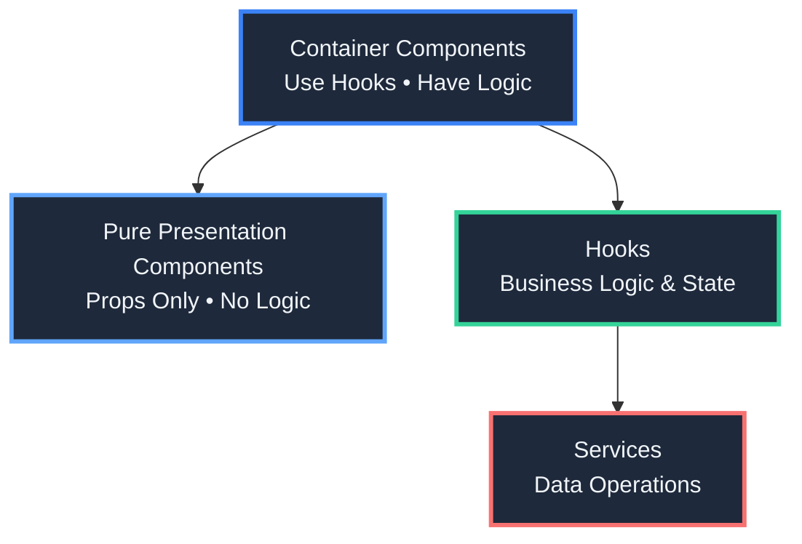

# 🏥 Amplify DataStore Task & Appointment Management App

<div align="center">

**A powerful React Native application for managing healthcare tasks, appointments, and patient assessments with seamless offline-first synchronization**

[](https://www.typescriptlang.org/)
[](https://reactnative.dev/)
[](https://expo.dev/)
[](https://aws.amazon.com/amplify/)

</div>

---

## ✨ Features

### 🎯 Core Functionality

#### 📋 **Task Management**

- ✅ Create, view, update, and delete tasks with full CRUD operations
- 🎨 Multiple task types: **SCHEDULED**, **TIMED**, **EPISODIC**
- 📊 Task status workflow: **OPEN** → **STARTED** → **INPROGRESS** → **COMPLETED**
- 📅 Smart task grouping by date and time
- 🔍 Advanced filtering by status, type, date range, and search text
- 🎬 Dynamic BEGIN/RESUME button logic based on task status

#### 📅 **Appointment Management**

- 🏥 View appointments grouped by date with timezone awareness
- 🚗 Appointment types: **ONSITE** visits and **TELEVISIT** consultations
- 📈 Appointment status tracking: **SCHEDULED**, **CANCELLED**, **COMPLETED**
- 🌍 Timezone-aware appointment display and formatting
- 📱 Detailed appointment information screens

#### 🩺 **Health Assessments & Questions**

- 📝 Multi-page question forms with progress tracking
- 🎨 Rich question types:
  - Single select, multi-select
  - Text input, number input
  - Date/time pickers
  - Numeric scales
- 🎬 Introduction and completion screens
- 👀 Review screen before final submission
- ⚡ Real-time answer validation with helpful error messages
- 💾 Persistent answer storage and retrieval

#### 🔗 **Coordinated Seeding System**

- 🎯 Create appointments with automatically linked tasks
- 📅 Pre-visit, visit-day, and post-visit task scheduling
- 🔗 Task-appointment relationships via anchors
- 📆 Dynamic date generation based on current date
- 🧪 Comprehensive seeding interface for testing

#### 🌐 **Internationalization (i18n)**

- 🌍 Multi-language support with intelligent translation service
- ↔️ RTL (Right-to-Left) language support for Arabic, Hebrew, etc.
- 🎨 Fully translated UI components and validation messages
- 🌐 Language selector in header for easy switching
- 🔄 Real-time language switching without app restart

#### 📡 **Offline-First Architecture**

- 🔄 Seamless synchronization with AWS AppSync
- 📶 Visual indicators for network and sync status
- 🛡️ Smart conflict resolution for data consistency
- 💾 Local SQLite storage for complete offline access
- ⚡ Instant UI updates with background sync

#### 🛡️ **Type Safety & Code Quality**

- 📘 Full TypeScript implementation with strict type checking
- 🔄 Generated types from GraphQL schema
- 🏗️ Type-safe service layer with comprehensive interfaces
- ✅ Unit tests for hooks, services, and components
- 📚 Comprehensive documentation

---

## 🏗️ Architecture

### 🎨 Component Architecture Pattern

The app follows a **clean separation of concerns** with a three-layer architecture:



### 🎯 Key Architectural Principles

1. **🧩 Custom Hooks for Logic**

   - All business logic lives in custom hooks (e.g., `useTaskList`, `useQuestionsScreen`)
   - Components remain pure and focused on rendering
   - Easy to test and reuse

2. **🔧 Service Layer Abstraction**

   - Data operations abstracted into services (e.g., `TaskService`, `AppointmentService`)
   - Consistent API across all data operations
   - Centralized error handling and logging

3. **📦 Component Separation**

   - Small, focused components with clear responsibilities
   - Components under ~200 lines (broken down if larger)
   - Reusable sub-components for common patterns

4. **🎨 Component Library Architecture**

   - **Base UI Components** (`components/ui/`) - Reusable, design-system components
   - **Feature Components** (`src/components/`) - Domain-specific components
   - **Question Components** (`src/components/questions/`) - Specialized question rendering
   - All components are fully typed, tested, and documented
   - Consistent styling and theming across all components

5. **🔒 Type Safety First**
   - Full TypeScript coverage with generated types from GraphQL schema
   - No `any` types - explicit typing throughout
   - Compile-time error catching

---

## 🎨 Component Library

The app is building out a **comprehensive, reusable component library** organized by purpose and reusability:

### 📚 Component Library Structure

```
components/
├── ui/                          # 🎨 Base UI Components (Design System)
│   ├── IconSymbol.tsx          # Icon component with SF Symbols support
│   ├── TabBarBackground.tsx     # Tab bar styling component
│   └── ...                     # Future: Button, Input, Card, Modal, etc.
│
src/components/
├── questions/                   # ❓ Question/Assessment Components
│   ├── QuestionRenderer.tsx    # Main question renderer
│   ├── SingleSelectQuestion.tsx
│   ├── MultiSelectQuestion.tsx
│   ├── TextQuestion.tsx
│   ├── NumberQuestion.tsx
│   ├── DateQuestion.tsx
│   ├── IntroductionScreen.tsx
│   ├── CompletionScreen.tsx
│   ├── ReviewScreen.tsx
│   ├── ProgressIndicator.tsx
│   └── ...
│
├── TaskCard.tsx                # 📋 Domain-Specific Components
├── AppointmentCard.tsx          # 📅 Domain-Specific Components
├── TasksGroupedView.tsx        # 📊 Feature Components
├── AppointmentsGroupedView.tsx
├── TaskFilters.tsx
├── TaskForm.tsx
├── GlobalHeader.tsx            # 🧩 Layout Components
├── NavigationMenu.tsx
├── LanguageSelector.tsx
├── NetworkStatusIndicator.tsx
└── ...
```

### 🎯 Component Library Principles

1. **🎨 Base UI Components** (`components/ui/`)

   - **Purpose**: Reusable, design-system level components
   - **Characteristics**:
     - Framework-agnostic styling
     - Fully typed with TypeScript
     - Accessible (WCAG compliant)
     - Theme-aware (light/dark mode support)
     - Platform-specific variants (iOS/Android)
   - **Examples**: Buttons, Inputs, Cards, Modals, Icons, Badges
   - **Status**: 🚧 In Progress - Currently has `IconSymbol`, expanding to full design system

2. **❓ Question Components** (`src/components/questions/`)

   - **Purpose**: Specialized components for health assessment forms
   - **Characteristics**:
     - Fully translated (i18n support)
     - Validation built-in
     - Accessible form controls
     - Consistent styling and behavior
   - **Status**: ✅ Complete - All question types implemented and tested

3. **📋 Domain Components** (`src/components/`)

   - **Purpose**: Business logic components specific to tasks, appointments, etc.
   - **Characteristics**:
     - Connected to data services
     - Use custom hooks for logic
     - Fully typed with domain types
   - **Status**: ✅ Complete - Task and appointment components implemented

4. **🧩 Layout Components** (`src/components/`)
   - **Purpose**: Navigation, headers, and layout structure
   - **Characteristics**:
     - Consistent app-wide styling
     - Responsive design
     - Platform-aware
   - **Status**: ✅ Complete - Header, navigation, and layout components implemented

### 🚀 Component Library Roadmap

#### 🔴 High Priority

- **Base UI Components Expansion**
  - ✅ `IconSymbol` - Complete
  - 🚧 `Button` - Standardized button component with variants (primary, secondary, outline)
  - 🚧 `Input` - Text input with validation states and error messages
  - 🚧 `Card` - Reusable card container with consistent styling
  - 🚧 `Modal` - Modal/dialog component with animations
  - 🚧 `Badge` - Status badges and labels
  - 🚧 `LoadingSpinner` - Consistent loading indicators
  - 🚧 `EmptyState` - Empty state messages with icons

#### 🟡 Medium Priority

- **Form Components**

  - `FormField` - Wrapper for form inputs with labels and errors
  - `Select` - Dropdown/select component
  - `Checkbox` - Checkbox input component
  - `Radio` - Radio button group component
  - `DatePicker` - Date selection component
  - `TimePicker` - Time selection component

- **Feedback Components**

  - `Toast` - Toast notification system
  - `Alert` - Alert dialog component
  - `Snackbar` - Snackbar notifications

- **Navigation Components**
  - `Breadcrumb` - Breadcrumb navigation
  - `Tabs` - Tab navigation component
  - `Stepper` - Multi-step form indicator

#### 🟢 Future Enhancements

- **Data Display Components**

  - `DataTable` - Sortable, filterable table
  - `Pagination` - Pagination controls
  - `InfiniteScroll` - Infinite scroll list
  - `Chart` - Chart/graph components

- **Advanced Components**
  - `Calendar` - Calendar picker component
  - `Timeline` - Timeline visualization
  - `Accordion` - Collapsible content sections
  - `Tooltip` - Tooltip component

### 📋 Component Development Standards

**All components in the library must:**

- ✅ **Be fully typed** - TypeScript interfaces for all props
- ✅ **Have unit tests** - Test rendering, interactions, and edge cases
- ✅ **Be documented** - JSDoc comments and usage examples
- ✅ **Support i18n** - All text content translatable
- ✅ **Be accessible** - WCAG 2.1 AA compliance
- ✅ **Follow design system** - Consistent styling and theming
- ✅ **Be responsive** - Work on all screen sizes
- ✅ **Support dark mode** - Theme-aware styling

**Component File Structure:**

```
ComponentName/
├── ComponentName.tsx          # Main component
├── ComponentName.test.tsx     # Unit tests
├── ComponentName.stories.tsx  # Storybook stories (future)
├── index.ts                   # Barrel export
└── README.md                  # Component documentation
```

---

## 📁 Project Structure

```
amplify-datastore-todo/
│
├── 📱 app/                          # Expo Router app directory
│   ├── (tabs)/                     # Tab-based navigation
│   │   ├── index.tsx               # 🏠 Dashboard (tasks & appointments)
│   │   ├── questions.tsx            # ❓ Question/assessment screen
│   │   ├── seed-screen.tsx         # 🌱 Data seeding interface
│   │   └── ...                     # Other tab screens
│   └── _layout.tsx                 # App layout configuration
│
├── 🎨 src/
│   ├── components/                  # UI Components
│   │   ├── questions/              # Question rendering components
│   │   │   ├── QuestionRenderer.tsx
│   │   │   ├── SingleSelectQuestion.tsx
│   │   │   └── ...
│   │   ├── TaskCard.tsx            # Task display card
│   │   ├── AppointmentCard.tsx     # Appointment display card
│   │   ├── TasksGroupedView.tsx    # Grouped task display
│   │   └── ...
│   │
│   ├── 🪝 hooks/                    # Custom React Hooks
│   │   ├── useTaskList.ts          # Task list logic
│   │   ├── useQuestionsScreen.ts   # Question screen orchestration
│   │   ├── useAppointmentList.ts   # Appointment list logic
│   │   ├── useTranslatedText.ts    # Translation hook
│   │   └── ...
│   │
│   ├── 🔧 services/                 # Data Services
│   │   ├── TaskService.ts          # Task CRUD operations
│   │   ├── AppointmentService.ts   # Appointment operations
│   │   ├── ActivityService.ts      # Activity/assessment operations
│   │   ├── ConflictResolution.ts  # DataStore conflict handling
│   │   └── ...
│   │
│   ├── 📘 types/                    # TypeScript Definitions
│   │   ├── Task.ts                 # Task types and enums
│   │   ├── Appointment.ts          # Appointment types
│   │   ├── Activity.ts             # Activity/assessment types
│   │   └── ...
│   │
│   ├── 🌐 contexts/                 # React Contexts
│   │   ├── AmplifyContext.tsx      # Amplify configuration
│   │   └── TranslationContext.tsx  # Translation state
│   │
│   └── 🛠️ utils/                    # Utility Functions
│       ├── activityParser.ts      # Activity JSON parsing
│       ├── appointmentParser.ts   # Appointment parsing
│       └── questionValidation.ts  # Question validation logic
│
├── 🌱 scripts/                      # Seed Data Scripts
│   ├── seed-coordinated-data.ts    # Coordinated task/appointment seeding
│   ├── seed-appointment-data.ts    # Appointment seeding
│   └── seed-question-data.ts       # Activity/question seeding
│
├── 📚 DOCS/                         # Documentation
│   ├── current-rule-logic.md      # Current rule implementation status
│   ├── todos.md                    # Rule engine implementation plan
│   └── testing-coordinated-seeding.md # Testing guide
│
├── 📦 models/                       # Amplify Generated Models
│
├── ⚙️ amplify/                      # Amplify Backend Configuration
│   └── backend/api/lxtodoapp/
│       └── schema.graphql          # GraphQL schema definition
│
└── ☁️ aws-exports.js                 # AWS Configuration (generated)
```

---

## 📊 Current Implementation Status

### ✅ Fully Implemented & Production Ready

| Feature                    | Status      | Description                                                |
| -------------------------- | ----------- | ---------------------------------------------------------- |
| **Task Management**        | ✅ Complete | Full CRUD operations, status workflow, filtering, grouping |
| **Appointment Management** | ✅ Complete | Fetching, display, timezone handling, grouping             |
| **Question System**        | ✅ Complete | Multi-page forms, validation, persistence, review screens  |
| **Data Seeding**           | ✅ Complete | Coordinated seeding with dynamic dates and relationships   |
| **Translation System**     | ✅ Complete | Multi-language support, RTL, translated UI and messages    |
| **Conflict Resolution**    | ✅ Complete | Smart merging, preserves user work, handles edge cases     |

### ⚠️ Partially Implemented

| Feature             | Status          | What's Missing                                                                        |
| ------------------- | --------------- | ------------------------------------------------------------------------------------- |
| **Rule Fields**     | ⚠️ Stored Only  | Fields exist but rules not enforced (`showBeforeStart`, `allowEarlyCompletion`, etc.) |
| **Task Visibility** | ⚠️ Basic Only   | Basic filtering works, time-based rules not enforced                                  |
| **Anchors**         | ⚠️ Storage Only | Stored and used for relationships, but not for rescheduling                           |

### 🚧 Not Yet Implemented

| Feature                   | Priority | Description                                                                    |
| ------------------------- | -------- | ------------------------------------------------------------------------------ |
| **Rule Engine**           | 🔴 High  | No rule parsing, evaluation, or action processing                              |
| **Time-Based Validation** | 🔴 High  | `showBeforeStart`, `allowEarlyCompletion`, `allowLateCompletion` not validated |
| **Anchor Rescheduling**   | 🔴 High  | No automatic rescheduling when appointments change                             |

---

## 🎯 What's Next

### 🔴 High Priority

#### 1. **Rule Engine Implementation**

- 📋 **Status**: Planned (see [DOCS/todos.md](DOCS/todos.md))
- 🎯 **Goal**: Parse and evaluate rules from JSON fields
- 🛠️ **Approach**: Consider using [json-rules-engine](https://github.com/cachecontrol/json-rules-engine)
- 📝 **Tasks**:
  - Implement rule parsing and evaluation
  - Process rule actions (e.g., START_TIMED_TASK)
  - Handle triggers (ON_TASK_COMPLETION, ON_TASK_START, ON_ANSWER_VALUE)

#### 2. **Time-Based Validation**

- 📋 **Status**: Fields exist, validation needed
- 🎯 **Goal**: Enforce completion and visibility rules
- 📝 **Tasks**:
  - Enforce `showBeforeStart` for task visibility
  - Validate `allowEarlyCompletion` and `allowLateCompletion`
  - Enforce `allowLateEdits` for post-completion editing

#### 3. **Anchor-Based Rescheduling**

- 📋 **Status**: Relationships stored, rescheduling needed
- 🎯 **Goal**: Automatically reschedule tasks when appointments change
- 📝 **Tasks**:
  - Monitor appointment date changes
  - Find linked tasks via anchors
  - Recalculate and update task dates

### 🟡 Medium Priority

#### 4. **Enhanced Task Filtering**

- Filter expired tasks
- Filter based on time windows
- Filter based on completion rules

#### 5. **Rule Engine UI**

- Show rule status indicators
- Display expiration countdowns
- Show completion windows

#### 6. **Testing & Documentation**

- Expand unit test coverage
- Add integration tests
- Update API documentation

---

## 🚀 Quick Start

### Prerequisites

- 📦 **Node.js** (v14 or later)
- 📥 **npm** or **yarn**
- 📱 **Expo CLI** (`npm install -g expo-cli`)
- ☁️ **AWS Account** (for backend services)
- 🔨 **AWS Amplify CLI** (`npm install -g @aws-amplify/cli`)

### Installation

1. **📥 Clone the repository**

   ```bash
   git clone <repository-url>
   cd amplify-datastore-todo
   ```

2. **📦 Install dependencies**

   ```bash
   npm install
   ```

3. **☁️ Pull the existing Amplify backend**

   ```bash
   amplify pull --appId d19l3dxjz56ge3 --envName dev
   ```

   Follow the prompts to configure the Amplify backend. This will create the necessary `aws-exports.js` file.

4. **🚀 Start the app**

   ```bash
   npm start
   ```

   In the output, you'll find options to open the app in:

   - 📱 [Android emulator](https://docs.expo.dev/workflow/android-studio-emulator/)
   - 🍎 [iOS simulator](https://docs.expo.dev/workflow/ios-simulator/)
   - 📲 [Expo Go](https://expo.dev/go) on your physical device

---

## 🧪 Testing

### Unit Test Coverage Requirements

**All new code must include unit tests.** This is a **mandatory requirement** for:

- ✅ **Custom Hooks** (`src/hooks/`) - All hooks must have corresponding test files
- ✅ **Services** (`src/services/`) - All services must have comprehensive test coverage
- ✅ **Components** (`src/components/`) - All components must have rendering and interaction tests
- ✅ **Stateless Functions** (`src/utils/`) - All utility functions must have unit tests

**Test File Naming Convention:**

- Hooks: `src/hooks/__tests__/useHookName.test.ts`
- Services: `src/services/__tests__/ServiceName.test.ts`
- Components: `src/components/__tests__/ComponentName.test.tsx` or `src/components/[category]/__tests__/ComponentName.test.tsx`
- Utils: `src/utils/__tests__/utilityName.test.ts`

**Test Requirements:**

- ✅ Test files must be created **alongside** source files (not as an afterthought)
- ✅ Test all return values, state changes, side effects, and edge cases
- ✅ Test user interactions (clicks, input changes, form submissions)
- ✅ Test error states and loading states
- ✅ Test edge cases (empty data, null values, invalid inputs)
- ✅ Use Jest and React Testing Library
- ✅ Mock external dependencies (DataStore, APIs, AsyncStorage, etc.)

**Current Test Coverage:**

| Category                | Location                              | Examples                                                                       |
| ----------------------- | ------------------------------------- | ------------------------------------------------------------------------------ |
| **Hooks**               | `src/hooks/__tests__/`                | `useAppointmentList.test.ts`, `useGroupedTasks.test.ts`                        |
| **Services**            | `src/services/__tests__/`             | `TaskService.test.ts`, `AppointmentService.test.ts`, `ActivityService.test.ts` |
| **Components**          | `src/components/__tests__/`           | `TaskCard.test.tsx`, `AppointmentCard.test.tsx`, `TasksGroupedView.test.tsx`   |
| **Question Components** | `src/components/questions/__tests__/` | `IntroductionScreen.test.tsx`, `SingleSelectQuestion.test.tsx`, etc.           |

### Testing Coordinated Seeding

See [DOCS/testing-coordinated-seeding.md](DOCS/testing-coordinated-seeding.md) for detailed testing instructions on the coordinated seeding system.

### Running Unit Tests

```bash
npm test
```

### Test Structure Example

```typescript
// src/hooks/__tests__/useTaskList.test.ts
import { renderHook, waitFor } from "@testing-library/react-native";
import { useTaskList } from "../useTaskList";

describe("useTaskList", () => {
  it("should fetch tasks on mount", async () => {
    const { result } = renderHook(() => useTaskList());

    await waitFor(() => {
      expect(result.current.loading).toBe(false);
    });

    expect(result.current.tasks).toBeDefined();
  });

  // ... more tests
});
```

---

## ☁️ AWS Architecture

### High-Level Overview

```mermaid
graph TB
    A[React Native App] --> B[DataStore]
    B --> C[Local SQLite]
    B --> D[AWS AppSync]
    D --> E[DynamoDB]
    B --> F[Sync Engine]
    F --> D

    style A fill:#61DAFB
    style B fill:#FF9900
    style D fill:#232F3E
    style E fill:#4053D6
```



### Key AWS Services

| Service           | Purpose         | Usage in App                                |
| ----------------- | --------------- | ------------------------------------------- |
| **AWS Amplify**   | Framework & CLI | Backend configuration and client libraries  |
| **AWS AppSync**   | GraphQL API     | Managed GraphQL service for data operations |
| **AWS DataStore** | Offline Sync    | Offline-first data synchronization          |
| **DynamoDB**      | Database        | Cloud storage for all data                  |

### Conflict Resolution

The app implements custom conflict resolution in `src/services/ConflictResolution.ts`:

- ✅ **Task Updates**: Prefers local status changes, remote timing updates
- ✅ **Deletions**: Accepts local deletions
- ✅ **Smart Merging**: Preserves user work while accepting server updates

---

## 📚 Documentation

| Document                                                                       | Description                                           |
| ------------------------------------------------------------------------------ | ----------------------------------------------------- |
| **[DOCS/current-rule-logic.md](DOCS/current-rule-logic.md)**                   | Current rule implementation status and what's missing |
| **[DOCS/todos.md](DOCS/todos.md)**                                             | Comprehensive rule engine implementation plan         |
| **[DOCS/testing-coordinated-seeding.md](DOCS/testing-coordinated-seeding.md)** | Testing guide for coordinated seeding feature         |

---

## 🎓 Development Guidelines

### Component Development Guidelines

- **🧩 Components should be small and focused** - if a component exceeds ~200 lines, break it down
- **🪝 All business logic lives in custom hooks** - components should only handle rendering
- **🔧 Services handle data operations** - hooks call services, services interact with DataStore

📖 See `.cursor/rules/component-architecture.mdc` for detailed guidelines.

### TypeScript Standards

- ❌ Never use `any` type
- ✅ Use explicit return types for functions
- ✅ Prefer interfaces over type aliases for object shapes
- ✅ Handle null/undefined explicitly

📖 See `.cursor/rules/typescript.mdc` for detailed guidelines.

### Testing Requirements

**⚠️ MANDATORY: All new code must include unit tests**

- ✅ **Create unit tests for ALL hooks, services, components, and stateless functions**
- ✅ **Test files must be created alongside source files** - not as an afterthought
- ✅ **Test coverage requirements:**
  - **Hooks**: Test all return values, state changes, side effects, and edge cases
  - **Services**: Test all public methods, error handling, and data transformations
  - **Components**: Test rendering, user interactions, props handling, and conditional rendering
  - **Utils**: Test all functions with various inputs and edge cases
- ✅ **Use Jest and React Testing Library**
- ✅ **Mock external dependencies** (DataStore, APIs, AsyncStorage, etc.)
- ✅ **Test error states and loading states**
- ✅ **Test edge cases** (empty data, null values, invalid inputs)

**When creating new code:**

1. Create the hook/service/component/function
2. **Immediately create the corresponding test file**
3. Write tests covering the main functionality
4. Ensure tests pass before considering the feature complete

📖 See `.cursor/rules/testing.mdc` for detailed guidelines.

---

## 🔗 Learn More

- 📘 [AWS Amplify Documentation](https://docs.amplify.aws/)
- 📘 [Amplify DataStore Documentation](https://docs.amplify.aws/lib/datastore/getting-started/q/platform/js/)
- 📘 [AppSync Documentation](https://docs.aws.amazon.com/appsync/)
- 📘 [Expo Documentation](https://docs.expo.dev/)
- 📘 [json-rules-engine](https://github.com/cachecontrol/json-rules-engine) - Potential library for rule engine implementation

---

<div align="center">

**Built with ❤️ using React Native, Expo, and AWS Amplify**

</div>
