# 🏥 Amplify DataStore Task & Appointment Management App

<div align="center">

**A powerful React Native application for managing healthcare tasks, appointments, and patient assessments with seamless offline-first synchronization**

[](https://www.typescriptlang.org/)
[](https://reactnative.dev/)
[](https://expo.dev/)
[](https://aws.amazon.com/amplify/)

</div>

---

## 🛠️ Tech Stack

### Frontend

- **React Native** - Cross-platform mobile framework
- **Expo** - Development platform and tooling
- **TypeScript** - Type-safe JavaScript
- **Expo Router** - File-based routing system

### Backend & Cloud

- **AWS Amplify** - Backend framework and CLI
- **AWS AppSync** - Managed GraphQL API
- **AWS DataStore** - Offline-first data synchronization
- **DynamoDB** - NoSQL database
- **GraphQL** - API query language

### Development Tools

- **Jest** - Testing framework
- **React Testing Library** - Component testing utilities
- **ESLint** - Code linting
- **Prettier** - Code formatting

### Data & Storage

- **SQLite** - Local database (via DataStore)
- **AsyncStorage** - Local key-value storage
- **DataStore Sync Engine** - Automatic data synchronization

---

## ✨ Features

### 🎯 Core Functionality

- **📋 Task Management** - Full CRUD operations, status workflow, filtering, and grouping
- **📅 Appointment Management** - Timezone-aware appointment display and management
- **🩺 Health Assessments** - Multi-page question forms with validation and persistence
- **🔗 Coordinated Seeding** - Create appointments with automatically linked tasks
- **🌐 Internationalization** - Multi-language support with RTL support
- **📡 Offline-First** - Seamless synchronization with AWS AppSync
- **🛡️ Type Safety** - Full TypeScript with comprehensive unit tests

📖 **For detailed feature information**, see [Implementation Status](DOCS/implementation-status.md)

---

## 🏗️ Architecture

### 🎨 Component Architecture Pattern

The app follows a **clean separation of concerns** with a three-layer architecture:

```mermaid
flowchart TD
    A["Container Components<br/>Use Hooks • Have Logic"]
    B["Pure Presentation Components<br/>Props Only • No Logic"]
    C["Hooks<br/>Business Logic & State"]
    D["Services<br/>Data Operations"]

    A --> C
    A --> B
    C --> D

    style A fill:#1e293b,stroke:#3b82f6,stroke-width:3px,color:#f1f5f9
    style B fill:#1e293b,stroke:#60a5fa,stroke-width:3px,color:#f1f5f9
    style C fill:#1e293b,stroke:#34d399,stroke-width:3px,color:#f1f5f9
    style D fill:#1e293b,stroke:#f87171,stroke-width:3px,color:#f1f5f9
```



### 🎯 Key Principles

1. **🧩 Custom Hooks for Logic** - All business logic lives in custom hooks
2. **🔧 Service Layer Abstraction** - Data operations abstracted into services
3. **📦 Component Separation** - Small, focused components with clear responsibilities
4. **🎨 Component Library** - Reusable, design-system components
5. **🔒 Type Safety First** - Full TypeScript coverage with generated types

📖 **For detailed architecture information**, see:

- [Component Library](DOCS/component-library.md)
- [Project Structure](DOCS/project-structure.md)
- [AWS Architecture](DOCS/aws-architecture.md)
- [Development Guidelines](DOCS/development-guidelines.md)

---

## 🚀 Quick Start

### Prerequisites

- 📦 **Node.js** (v14 or later)
- 📥 **npm** or **yarn**
- 📱 **Expo CLI** (`npm install -g expo-cli`)
- ☁️ **AWS Account** (for backend services)
- 🔨 **AWS Amplify CLI** (`npm install -g @aws-amplify/cli`)

### Installation

1. **📥 Clone the repository**

   ```bash
   git clone <repository-url>
   cd amplify-datastore-todo
   ```

2. **📦 Install dependencies**

   ```bash
   npm install
   ```

3. **☁️ Pull the existing Amplify backend**

   ```bash
   amplify pull --appId d19l3dxjz56ge3 --envName dev
   ```

   Follow the prompts to configure the Amplify backend. This will create the necessary `aws-exports.js` file.

4. **🚀 Start the app**

   ```bash
   npm start
   ```

   In the output, you'll find options to open the app in:

   - 📱 [Android emulator](https://docs.expo.dev/workflow/android-studio-emulator/)
   - 🍎 [iOS simulator](https://docs.expo.dev/workflow/ios-simulator/)
   - 📲 [Expo Go](https://expo.dev/go) on your physical device

---

## 📚 Documentation

| Document                                                               | Description                                                |
| ---------------------------------------------------------------------- | ---------------------------------------------------------- |
| **[Implementation Status](DOCS/implementation-status.md)**             | Current feature implementation status and what's missing   |
| **[Roadmap](DOCS/roadmap.md)**                                         | Future development priorities and planned features         |
| **[Component Library](DOCS/component-library.md)**                     | Component library structure, principles, and roadmap       |
| **[Project Structure](DOCS/project-structure.md)**                     | Detailed directory structure and organization              |
| **[AWS Architecture](DOCS/aws-architecture.md)**                       | AWS services, data flow, and conflict resolution           |
| **[Development Guidelines](DOCS/development-guidelines.md)**           | Coding standards, testing requirements, and best practices |
| **[Testing Guide](DOCS/testing.md)**                                   | Unit test requirements, coverage, and examples             |
| **[Rule Engine Plan](DOCS/todos.md)**                                  | Comprehensive rule engine implementation plan              |
| **[Current Rule Logic](DOCS/current-rule-logic.md)**                   | Current rule implementation status                         |
| **[Testing Coordinated Seeding](DOCS/testing-coordinated-seeding.md)** | Testing guide for coordinated seeding feature              |

---

## 🧪 Testing

**All new code must include unit tests.** This is a mandatory requirement for hooks, services, components, and utility functions.

📖 **For detailed testing requirements and examples**, see [Testing Guide](DOCS/testing.md)

**Quick Start:**

```bash
npm test
```

---

## 🎯 Current Status

- ✅ **Fully Implemented**: Task management, appointments, questions, seeding, translation, conflict resolution
- ⚠️ **Partially Implemented**: Rule fields (stored but not enforced), task visibility, anchors
- 🚧 **Not Yet Implemented**: Rule engine, time-based validation, anchor rescheduling

📖 **For detailed status information**, see [Implementation Status](DOCS/implementation-status.md)

📖 **For future plans**, see [Roadmap](DOCS/roadmap.md)

---

## 🔗 Learn More

- 📘 [AWS Amplify Documentation](https://docs.amplify.aws/)
- 📘 [Amplify DataStore Documentation](https://docs.amplify.aws/lib/datastore/getting-started/q/platform/js/)
- 📘 [AppSync Documentation](https://docs.aws.amazon.com/appsync/)
- 📘 [Expo Documentation](https://docs.expo.dev/)
- 📘 [json-rules-engine](https://github.com/cachecontrol/json-rules-engine) - Potential library for rule engine implementation

---

<div align="center">

**Built with ❤️ using React Native, Expo, and AWS Amplify**

</div>
