# 🏥 Amplify DataStore Task & Appointment Management App

<div align="center">

**A powerful React Native application for managing healthcare tasks, appointments, and patient assessments with seamless offline-first synchronization**

[](https://www.typescriptlang.org/)
[](https://reactnative.dev/)
[](https://expo.dev/)
[](https://aws.amazon.com/amplify/)
[](https://codecov.io/gh/YOUR_USERNAME/YOUR_REPO)

</div>

---

## 🛠️ Tech Stack

### 🎨 Frontend

| Technology          | Purpose                          | Why We Use It                                            |
| ------------------- | -------------------------------- | -------------------------------------------------------- |
| **⚛️ React Native** | Cross-platform mobile framework  | Write once, run on iOS and Android                       |
| **🚀 Expo**         | Development platform and tooling | Fast development, over-the-air updates, managed workflow |
| **📘 TypeScript**   | Type-safe JavaScript             | Catch errors at compile-time, better IDE support         |
| **🧭 Expo Router**  | File-based routing system        | Intuitive navigation, type-safe routes                   |

### ☁️ Backend & Cloud

| Technology           | Purpose                            | Why We Use It                                |
| -------------------- | ---------------------------------- | -------------------------------------------- |
| **🔧 AWS Amplify**   | Backend framework and CLI          | Rapid backend setup, integrated services     |
| **📡 AWS AppSync**   | Managed GraphQL API                | Real-time subscriptions, automatic scaling   |
| **💾 AWS DataStore** | Offline-first data synchronization | Works offline, automatic conflict resolution |
| **🗄️ DynamoDB**      | NoSQL database                     | Serverless, auto-scaling, low latency        |
| **🔍 GraphQL**       | API query language                 | Flexible queries, type-safe, single endpoint |

### 🛠️ Development Tools

| Technology                   | Purpose                     | Why We Use It                                   |
| ---------------------------- | --------------------------- | ----------------------------------------------- |
| **✅ Jest**                  | Testing framework           | Fast, comprehensive, great React Native support |
| **🧪 React Testing Library** | Component testing utilities | Test user behavior, not implementation          |
| **🔍 ESLint**                | Code linting                | Catch bugs early, enforce code quality          |
| **💅 Prettier**              | Code formatting             | Consistent code style, zero configuration       |

### 💾 Data & Storage

| Technology                   | Purpose                        | Why We Use It                                        |
| ---------------------------- | ------------------------------ | ---------------------------------------------------- |
| **📱 SQLite**                | Local database (via DataStore) | Fast, reliable, perfect for offline-first            |
| **🔑 AsyncStorage**          | Local key-value storage        | Simple persistence for app settings and cache        |
| **🔄 DataStore Sync Engine** | Automatic data synchronization | Seamless cloud sync, handles conflicts intelligently |

---

## ✨ Features

### 🎯 Core Functionality

- **📋 Task Management** - Full CRUD operations, status workflow, filtering, and grouping
- **📅 Appointment Management** - Timezone-aware appointment display and management
- **🩺 Health Assessments** - Multi-page question forms with validation and persistence
- **🔗 Coordinated Seeding** - Create appointments with automatically linked tasks
- **🌐 Internationalization** - Multi-language support with RTL support
- **📡 Offline-First** - Seamless synchronization with AWS AppSync
- **🛡️ Type Safety** - Full TypeScript with comprehensive unit tests

📖 **For detailed feature information**, see [Implementation Status](DOCS/implementation-status.md)

---

## 🏗️ Architecture

### 🎨 Component Architecture Pattern

The app follows a **clean separation of concerns** with a three-layer architecture:

```mermaid
flowchart TD
    A["Container Components<br/>Use Hooks • Have Logic"]
    B["Pure Presentation Components<br/>Props Only • No Logic"]
    C["Hooks<br/>Business Logic & State"]
    D["Services<br/>Data Operations"]

    A --> C
    A --> B
    C --> D

    style A fill:#1e293b,stroke:#3b82f6,stroke-width:3px,color:#f1f5f9
    style B fill:#1e293b,stroke:#60a5fa,stroke-width:3px,color:#f1f5f9
    style C fill:#1e293b,stroke:#34d399,stroke-width:3px,color:#f1f5f9
    style D fill:#1e293b,stroke:#f87171,stroke-width:3px,color:#f1f5f9
```



### 🎯 Key Principles

1. **🧩 Custom Hooks for Logic** - All business logic lives in custom hooks
2. **🔧 Service Layer Abstraction** - Data operations abstracted into services
3. **📦 Component Separation** - Small, focused components with clear responsibilities
4. **🎨 Component Library** - Reusable, design-system components
5. **🔒 Type Safety First** - Full TypeScript coverage with generated types

📖 **For detailed architecture information**, see:

- [Component Library](DOCS/component-library.md)
- [Project Structure](DOCS/project-structure.md)
- [AWS Architecture](DOCS/aws-architecture.md)
- [Development Guidelines](DOCS/development-guidelines.md)
- [Task System Package (LX Integration)](DOCS/task-system-package.md)

---

## 🚀 Quick Start

### Prerequisites

- 📦 **Node.js** (v14 or later)
- 📥 **yarn** (package manager) - This project uses yarn workspaces
- 📱 **Expo CLI** (`yarn global add expo-cli`)
- ☁️ **AWS Account** (for backend services)
- 🔨 **AWS Amplify CLI** (`yarn global add @aws-amplify/cli`)

### Package Information

- **Android Package**: `com.orion.tasksystem`
- **iOS Bundle Identifier**: `com.orion.tasksystem`
- **Workspace Package**: `@orion/task-system` (located in `packages/task-system/`)

### Installation

1. **📥 Clone the repository**

   ```bash
   git clone <repository-url>
   cd Task-System-POC
   ```

2. **📦 Install dependencies**

   ```bash
   yarn install
   ```

   This will install dependencies for both the main app and the workspace package (`@orion/task-system`).

3. **☁️ Pull the existing Amplify backend**

   ```bash
   amplify pull --appId d2vty117li92m8 --envName dev
   ```

   Follow the prompts to configure the Amplify backend. This will create the necessary `aws-exports.js` file.

4. **🏗️ Generate native projects (if needed)**

   If you need to build native iOS/Android apps:

   ```bash
   expo prebuild
   ```

5. **🚀 Start the app**

   ```bash
   yarn start
   ```

   In the output, you'll find options to open the app in:
   - 📱 [Android emulator](https://docs.expo.dev/workflow/android-studio-emulator/)
   - 🍎 [iOS simulator](https://docs.expo.dev/workflow/ios-simulator/)
   - 📲 [Expo Go](https://expo.dev/go) on your physical device

   **Note:** Native build fixes are **automatically applied** when running `yarn ios` or `yarn android`. For iOS, run `yarn ios:install-pods` after the first build or when pods change.

   📖 **For details**, see [Native Build Fixes](DOCS/native-build-fixes.md)

---

## 📚 Documentation

| Document                                                               | Description                                                |
| ---------------------------------------------------------------------- | ---------------------------------------------------------- |
| **[Implementation Status](DOCS/implementation-status.md)**             | Current feature implementation status and what's missing   |
| **[Roadmap](DOCS/roadmap.md)**                                         | Future development priorities and planned features         |
| **[Component Library](DOCS/component-library.md)**                     | Component library structure, principles, and roadmap       |
| **[Project Structure](DOCS/project-structure.md)**                     | Detailed directory structure and organization              |
| **[AWS Architecture](DOCS/aws-architecture.md)**                       | AWS services, data flow, and conflict resolution           |
| **[Development Guidelines](DOCS/development-guidelines.md)**           | Coding standards, testing requirements, and best practices |
| **[Testing Guide](DOCS/testing.md)**                                   | Unit test requirements, coverage, and examples             |
| **[Coverage Setup](DOCS/coverage-setup.md)**                           | GitHub Actions coverage reporting and Codecov setup        |
| **[Native Build Fixes](DOCS/native-build-fixes.md)**                   | Required fixes for iOS and Android native builds           |
| **[Rule Engine Plan](DOCS/todos.md)**                                  | Comprehensive rule engine implementation plan              |
| **[Current Rule Logic](DOCS/current-rule-logic.md)**                   | Current rule implementation status                         |
| **[Testing Coordinated Seeding](DOCS/testing-coordinated-seeding.md)** | Testing guide for coordinated seeding feature              |

---

## 🧪 Testing

**All new code must include unit tests.** This is a mandatory requirement for hooks, services, components, and utility functions.

📖 **For detailed testing requirements and examples**, see [Testing Guide](DOCS/testing.md)

**Quick Start:**

```bash
# Run all tests
yarn test

# Run tests in watch mode
yarn test:watch

# Generate coverage report
yarn test:coverage
```

**Coverage Reports:**

- **Pull Requests**: Coverage summary is automatically posted as a comment on every PR showing overall coverage metrics
- **Local**: Coverage reports are generated in the `coverage/` directory. Open `coverage/lcov-report/index.html` in your browser for a detailed interactive report.
- **GitHub Actions**: Coverage reports are automatically generated on every push and PR. View them in:
  - PR comments (automatic coverage summary)
  - Workflow artifacts (downloadable HTML reports)
  - Codecov dashboard (if configured - see setup instructions below)
  - Coverage summary in workflow run details

---

## 🎯 Current Status

- ✅ **Fully Implemented**: Task management, appointments, questions, seeding, translation, conflict resolution, task completion workflow
- ⚠️ **Partially Implemented**: Rule fields (stored but not enforced), task visibility, anchors
- 🚧 **Not Yet Implemented**: Rule engine, time-based validation, anchor rescheduling

📖 **For detailed status information**, see [Implementation Status](DOCS/implementation-status.md)

📖 **For future plans**, see [Roadmap](DOCS/roadmap.md)

## 📦 Project Structure

This project uses **yarn workspaces** with the following structure:

- **Main App** (`src/`, `app/`) - The Expo Router application
- **Workspace Package** (`packages/task-system/`) - Reusable task/activity module (`@orion/task-system`)
- **Shared Components** (`components/ui/`) - Base UI design system components

📖 **For detailed structure information**, see [Project Structure](DOCS/project-structure.md) and [Task System Package](DOCS/task-system-package.md)

---

## 🔗 Learn More

- 📘 [AWS Amplify Documentation](https://docs.amplify.aws/)
- 📘 [Amplify DataStore Documentation](https://docs.amplify.aws/lib/datastore/getting-started/q/platform/js/)
- 📘 [AppSync Documentation](https://docs.aws.amazon.com/appsync/)
- 📘 [Expo Documentation](https://docs.expo.dev/)
- 📘 [json-rules-engine](https://github.com/cachecontrol/json-rules-engine) - Potential library for rule engine implementation

---

<div align="center">

**Built with ❤️ using React Native, Expo, and AWS Amplify**

</div>
